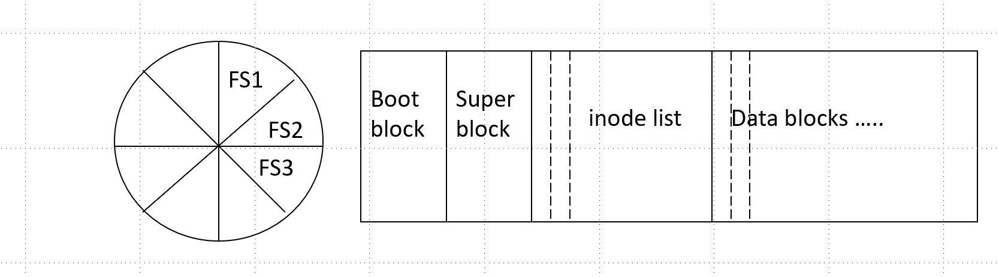

**August 20, 2019**  
**ATMOS 5020: Environmental Programming**  
**John Horel & ...**

# Welcome to ATMOS 5020: Environmental Programming

Canvas: https://utah.instructure.com/courses/573777  
GitHub: https://github.com/johnhorel/ATMOS_5020_2019

> # Today’s Objectives
> 1. Log onto the 711 Macs
> 1. Review nuts and bolts of the class
>     - https://utah.instructure.com/courses/573777  
> 1. Set-up and use Teams
> 1. Introduce Linux and basic commands on the Mac

## Logging onto the 711 WBB Macs
- Your **username** and **password** are the ones you use for Canvas, CIS, umail, etc.
- Poke around, you won’t break anything!
    - Click on the left most: `Finder`
    - Look under `Applications` --> `Utilities` 
    - Open `Terminal` or `XQuartz`

# ATMOS 5020: Environmental Programming

### Instructors
  - **Professor John Horel** INSCC 483. Office  (801) 581-7091. Cell (801) 870-9450.  john.horel@utah.edu. Office hours: By appointment
  - TA: **TBA** INSCC 480. 

Emails sent to us to arrange for an appointment or to discuss a class-related topic should include ATMOS 5020 in the subject line.  **Or send it via Teams!**

Access class assignments through your courses in the Canvas CIS system: https://utah.instructure.com/courses/573777

It might be helpful to bring a flash drive to move files you want to continue working on after class. Or, use `Ubox` (box.utah.edu) to upload and later retrieve your course content.

## Text Books
- **Required**: _Python Programming and Visualization for Scientists_. A. deCaria.
    - https://sundogpublishingstore.myshopify.com/products/python-programming-and-visualization-for-scientists-alex-j-decaria
- **Recommended**: _A Hands-On Introduction to Using Python in the Atmospheric and Oceanic Sciences_.
    - Chapters can be downloaded for free from  http://www.johnny-lin.com/pyintro/

### Prerequisite
- MATH 1210

# Course Description

This is a short course in computer programming. Why do we learn how to program computers? To make our lives easier through automation and complex calculations.

Learning to program is similar to learning a spoken language:
- It is hard to do.
- It is easier for some people than others.
- It is difficult to learn how on your own by just reading a book.
- It requires practice. _Lots of practice_.

Environmental scientists need the ability to acquire and process environmental data and communicate results based on processing that data efficiently. In this class, we will
- Focus on programming fundamentals and selected applications of scientific computer programming relevant to environmental fields.
- Stress skills necessary to solve physically-based problems using computational resources and methods.
- Focus on the linux computing environment using the open source Python language. Programming concepts independent of language syntax are stressed.

## At the end of the course you will be able to:
1. Become familiar with the Linux computing environment.
1. Perform basic scientific calculations relevant to environmental fields using Python. 
1. Use best practices to design, write, and debug computer programs. 
1. Develop confidence to modify example codes to obtain new capabilities for the underlying code (i.e., progress onward from cookbook-style programming).
1. Employ techniques to access, process, and visualize environmental data sets on Linux computers.

## How to succeed in this class
1. Review the notes and repeat the class exercises.
2. Review the links to info provided in the assignments and in the notes.
3. Organize the info in ways that help you access it quickly:
    - On your phone using an app?
    - Writing it down on a piece of paper, egads?
    - Writing it on a file accessible via Ubox?
    - Ask your classmates questions using Teams

## Format
- Class sessions will be held in 711 WBB that allows for a mix of instructional styles.
    - Brief lectures.
    - Follow along with the instructor and answer quick questions.
    - Independent lab work. You are being given considerable time in the lab to complete assignments. Take advantage of this.
- Much of the instructional material will be online as markdown files (like this document) on GitHub or as PDFs of PowerPoint slides. 
- You must complete and turn in assignments by the assigned due date. There is no credit for late work without approval in advance to do so.
- Bring a USB drive to save your work, or upload files to Ubox.

### "Check Your Understanding" quizzes
"Check Your Understanding" assignments on Canvas are tied to lectures. You should retake the _Check Your Understanding_ quizzes until you get the answers right.

### Assignments
You should have time to complete assignments during class. If you need more time, you should take advantage of computers in other labs on campus.

## Grading

> **Plagiarizing, copying, or otherwise misrepresenting ones' work will not be tolerated.**

- 30% Class participation and _Check Your Understanding_ quizzes
- 70% Assignments

|      |                       |
|------|-----------------------|
|90% + | guarantees an A or A- |
|80% + | guarantees a B+, B, or B- |
|70% + | guarantees a C+, C, or C- |
|60% + | guarantees a D+, D, or D- |
|below 60%| may result in an E |

_Cutoff points for the specific grades are identified to define reasonable distribution of grades._

# Communication is key!

You can send questions using Canvas, BUT a better way may be to use Teams! **The benefit of using Teams is that you can communicate and collaborate with your classmates in an organized way.** This will be a useful tool when you get stuck on assignments. 

Aside from homework help, learning how to use Teams is a useful skill because you will very likely use collaboration tools in a future job.

As part of the first assignment, you are to send me a couple messages using Teams. You will also answer poll questions using Teams today.
- Download the Teams app to your phone, computer, or just use it from a browser.
- Join our Teams workspace: https://teams.microsoft.com/l/team/19%3a0e0b5e28bbd14883a0c075df95b94c05%40thread.skype/conversations?groupId=822f4682-c35b-4daa-a42a-12d72c857a0b&tenantId=5217e0e7-539d-4563-b1bf-7c6dcf074f91

> **NOTE:** You need to use your campus UNID, not another Microsoft account.

---
---
  

# Introduction to Computers

## Computing Hardware is Ever Changing

- Phones, tablets
- Laptops, desktops
- Shared computing resources provided by University (Center for High Performance Computing)
- Cloud computing: Amazon, Google, Microsoft

## Computing Environment Is Ever Changing

- Enter code
- Cards
- Text terminals
- Graphical User Interface (GUI)

## Many Languages
- Assembly
- Cobol, Basic
- Fortran, C, C++
- Python, R, Julia, Go

Read: https://www.techrepublic.com/article/julia-whats-next-for-pythons-fast-growing-programming-language-rival/
  

## Increasing Connectedness of Computers
  https://www.isc.org/network/survey/ 

## The nuts and bolts

Modern computers have:
- 2-4 “cores” or central processing units (cpus).
- Each cpu has ram (most used) and cache (fastest access) memory.
- Some storage medium/disk.
- “Peripherals” are that: peripheral

# What is UNIX?
UNIX is a command line operating system developed in late 60’s at Bell Labs.
- Multi-tasking and multi-user operating system
- Originally written using C
- Unix is designed so that users can extend the functionality:
  - To build new tools easily and efficiently
  - To customize the shell and user interface.
  - To string together a series of Unix commands to create new functionality.
  - To create custom commands that do exactly what we want.

Around 1990, Linus Torvalds of Helsinki University developed an open source/academic version of Unix known as **Linux**. (Some history: https://www.linux.com/news/linus-torvalds-reflects-25-years-linux).

## Features of Unix System
1. Simple design, organization, and functioning
2. Portability
3. Background processing
4. Hierarchical File System
5. Multi-user
6. Multi-tasking
7. Security
8. Interactive Operating System
9. Communication facilities
10. Utilities

## Mac OS X is a variant of Linux
- Other variants: Ubuntu, Red Hat, and CentOS
- Mac OS X has a "desktop environment” to provide a graphical user interface to application programs and system settings
- You can use the basic features of linux on a Mac using the terminal, XQuartz, Atom application programs

> ### Really want to get started?
> Check out material from the lectures from Utah's Center for High Performance Computing:
> - https://www.chpc.utah.edu/presentations/IntroLinux3parts.php  
>
> Other resources:
> - https://www.guru99.com/introduction-linux.html
> - https://linuxsurvival.com/linux-tutorial-introduction/
> - Many other resources (Google around for Linux Tutorials)

# Shell

The “Shell” is simply the layer on top of the operating system that provides a basic human-OS interface.

- It is a command interpreter
- Built on top of the operating system kernel
- Enables users to run services provided by the UNIX OS
- In its simplest form, a series of commands in a file is a shell program that saves having to retype commands to perform common tasks.

## Linux on Mac

The **Command Line Interface (CLI)** is how you interact with the linux shell on your Mac.

Open x-term window using `terminal` or `XQuartz`.

> When using the CLI, imagine your computer doesn't have a mouse. All input is typed.

Type the following command

     echo $SHELL
  
If it does not say `tcsh`, then type `exec tcsh` or just `tcsh`
  	
When done with the terminal, type `exit`.

> **ALWAYS EXIT** terminal windows and **LOG OUT** when done.

## Unix tcsh shell
The tc shell is a variation of the C shell. It reads the same configuration files that the C shell uses. 

Tcsh contains command line editing keystrokes that the C shell is missing, and has more "modern" conveniences that the C shell lacks.

# Unix File System
The Unix file system is the structure in which all the information on your computer is stored.
- It has hierarchical file structure, where each directory can contain files, as well as other directories.
- It looks like an upside down tree.
- Unix looks at everything as a file.
  - At the top of the tree is the root directory, represented by a forward slash, `/`.
  - Then, there are a set of common directories such as `/bin`, `/dev`, `/home`, etc.

# Try this! Navigating directories
The first thing to do in the terminal is to find out where you are at. Type:

    pwd

`pwd` stands for "print working directory". Since you are on a local disk on this Mac, each local disk is separate from the others.

By default, this is your “home” directory on this specific computer.

Now try:

    ls

`ls` stands for "list contents". This command shows you the subdirectories created in your home directory.

    cd Desktop
    pwd
    cd ..

> ## Question: Where are you now?
> Answer the poll question in Teams:
>  - Desktop
>  - Home directory
>  - No clue? Help!!

# Try this! Creating a file

    cd

Where are you now? (check with `pwd`)

    ls
<!---->
    ls  > subdirs.txt
<!---->
    ls 

What is in the directory now?

    more subdirs.txt 
    
What do you see?

    cp subdirs.txt Desktop/

What’s now on your Desktop screen?

Double click the new file. What do you see? _Answer in Teams_.

# Unix File System

Some key differences between Windows and Unix file systems.

|Windows|Linux|
|--|--|
|file system drive letters represent different storage devices, like `C:` is a hard disk, etc.|All storage devices are in the same file system hierarchy.|
|Uses backslash `\` to separate directory names| Uses forward slash `/` to separate directory names|
||Every file and directory in a Linux system has permissions and ownership associated with it.
|File names have suffixes (like .png, .txt, etc.) | suffixes are not required, but used by convention|

 

In Unix systems, the chunk of the disk is divided into blocks (1024-bytes block, or 4096-bytes block, etc.) in multiples of 512 bytes in size.

These blocks are organized into four groupings: boot block, superblock, inode blocks, and data blocks.

# Try this! File system commands
|Unix Command|What it does|
|--|--|
|`pwd`|Where you are now on the file system?
|`cd` |Return to your home directory
|`df -m`|What disks are on the system and the amount of space available in kilobytes
|`who`|  The command shows who is logged on
|`finger [unid]`|   Who is UNID
|`date`|     Prints the system date and time
|`cal`| Prints a calendar
|`man`|      Formats and displays on-line manual pages. Type `q` to exit.
|`history`|  List prior commands
|``!!``|     Previous command
|``! XXX``|  Repeat prior command number XXX

# Try this! List contents of directories
    
    ls [-options]

### Option Description
|`ls` Command Options|What it does|
|--|--|
|`ls -l`| 	list in long format
|`ls -C`|	multicolumn output
|`ls -F`|	indicates type of file by `/`, `*`
|`ls -r`|   List files in reverse order
|`ls -R`|	recursive listing of all subdirectories	encountered
|`ls -a`| 	list all files including hidden files
|`ls -t`|    sort by time modified

# Try this! Change Directories
`cd` Changes the working directory to the directory if specified or to the home directory otherwise

    cd [directory name]  
### Option Description
|`cd` Command Usage|What it does|
|--|--|
|`cd ..`| Go up/back one directory
|`cd dirname/`| Change to dirname directory relative to the location you are currently in

# Try this! Making a new directory

    cd

Where are you?

    cd Desktop
    mkdir temp
    
What’s now on your Desktop?

    cd temp
    ls
    
Are there any files in that directory now?

# Doing some science
In your browser, click on the following link:
https://mesowest.utah.edu/cgi-bin/droman/time_chart_dyn.cgi?stn=WBB&unit=0&past=0&month1=&day1=00&year1=&hour1=00&time=LOCAL&hours=24&var=TMPF&gsize=0.85&level=All

Right click on the image as “Save Image As” to your `temp` directory.

In the temp directory, 

    ls –ltr

Double click on the image in your temp directory

# _**Practice, Practice, Practice**_
After today, you should be able to:
1. Open the terminal on the Mac and type commands.
1. List the current path and files contained in the path.
1. Comfortably navigate to different directories.
1. Send (write) output to a file instead of printing it to the screen.

> For more practice, try these online tutorials:
> - https://www.javatpoint.com/linux-tutorial
> - https://ryanstutorials.net/linuxtutorial/
> - https://www.tutorialspoint.com/unix/
> - http://www.ee.surrey.ac.uk/Teaching/Unix/

--- 
---

# What should you be doing?
- Review all the material in these notes.
- Practice!

1. Complete anonymous survey in Canvas by midnight
2. _Check your understanding_ #1 by midnight Friday
3. _Check your understanding_ #2 by midnight Monday

