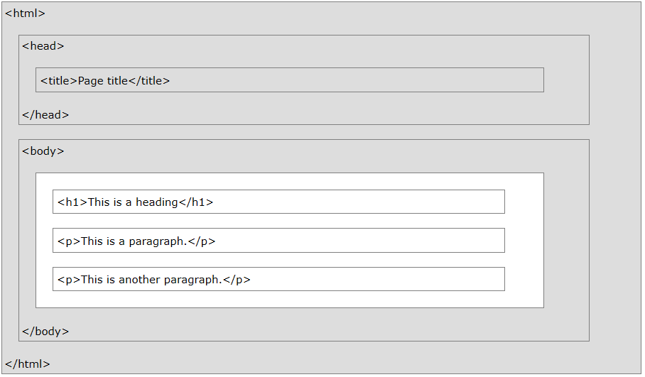

**August 27, 2019**  
**ATMOS 5020: Environmental Programming**  
**Brian Blaylock and John Horel**

> # Announcements:
> ## Check your understanding #2 is due on August 30th.  
> You need to create hand-written reference sheet for Linux commands and logging onto CHPC resources. Send a copy to me via Teams.
> ## Assignment #1 is Due on September 2nd.  
> **5 questions**. Use lab time today and Thursday to work on this.

> # Today's Objectives
> - Review logging onto CHPC resources
> - Write and run a shell script
> - Copy files to CHPC resources
> - Introduction to build a webpage with HTML

<br><br>

# Log onto the CHPC computer `meteo07.chpc.utah.edu`

    ssh -l uXXXXXXX -Y meteo07.chpc.utah.edu

And then `cd` into your `public_html/5020` directory.

<br><br>

# Running Linux commands with shell scripts
Often, we want to execute commands more than once and have a record of how we did it.

When a group of commands has to be executed regularly, we can store them in a file and execute those commands from the file. Such files are called **shell scripts**, **shell programs**, or **shell procedures**.

There is no restrictions on file extension, but to denote a tcsh-shell script it is best to use the extension `.csh`.

Copy a shell script to your directory

    cp ~u0035056/public_html/5020/first.csh .


    # Remember the format of this copy command is...
    cp <what do you want to copy> <where do you want to copy>

Look in this file
- `more first.csh`
- `chmod +x first.csh` (what does this do?)
- `./first.csh` (what happened?)
    - Note: The `./` indicates to look for the scrip in the current directory.

No compiler is required to run a shell script, because the UNIX shell acts as an interpreter when reading script files.

After you create a shell script, you simply tell the OS that the file is a program that can be executed, by using the `chmod` command to change the file's mode to be executable.

Shell programs are slower than compiled programs, because the shell must interpret each UNIX command inside the executable script file before it is executed.

A tsch shell script must begin with the line

    #!/bin/tcsh

<br><br>
# Looking at web cam images
Go to  http://home.chpc.utah.edu/~u0790486/wxinfo/cgi-bin/uunet_camera_explorer.cgi

Click on the image and look at the web page location: http://meso1.chpc.utah.edu/station_cameras/wbbw_cam/wbbw_cam_current.jpg

We want to save those images and post on a web page.

Copy a scripts from the class directory to your own `public_html` class directory

    cp ~u0035056/public_html/5020/camera.csh .
    chmod +x camera.csh
    ./camera.csh

What happened?

Look at the script...

    more camera.csh

# Examining the shell script
Grabbing camera images: `camera.csh`. Pay attention to the _semantics_ and _syntax_ unique to a shell script.

|||
|--|--|
|`#!/bin/tcsh`| indicates computer to use the tcsh shell (not bash). This is always the first line.
|`set ctr = 0`| assign a value of 0 to ctr (counter)
|`# going to loop 3 times`| `#` indicates a comment. The text that follows on this line is not code.
|`while ( $ctr < 3 )`|  loop while ctr is less than 3 (0,1,2)
|```set file = wbbw_`date -u +%Y%m%d%H%M%S`.jpg```| we are using the date function in a specific time string format and set the variable file to a string
|`echo grabbing wbbw image no $ctr`| writing to the terminal before getting the image
|`curl "http://meso1.chpc.utah.edu/station_cameras/wbbw_cam/wbbw_cam_current.jpg" -o $file`| using the function curl to get the image from a directory and save it to a file named file1. Type `man curl` to see what curl is about.
|`sleep 10`| wait 10 seconds before grabbing the next image
|`@ ctr++`| increment the counter from 0 to 1 to 2 and then it'll stop
|`end`| the end of the while loop


## Look in your web directory using a browser
- http://home.chpc.utah.edu/~uXXXXXXX/5020/
    - Replace the X’s with your unid
- What is in your directory now?

# Let’s do something!
How do you switch in the shell script to the Bonneville Salt Flat camera?
- Go to: http://home.chpc.utah.edu/~u0790486/wxinfo/cgi-bin/uunet_camera_explorer.cgi
- Shift to the BFLAT camera and then click to the image
- What needs to be changed about the `curl` line in terms of the directory and file name?

## Editing files in Unix
- Choice:
  - edit on remote server that you will be running the program or…
  - edit on local computer and upload or run the program remotely from your local computer
- Choice:
  `vim` (NOT WYSWYG) vs. `emacs` or `gedit`: arguments galore on the “best” editor
- vim - proper indents for python, etc.
- Lots of other powerful editors (VS Code, Atom, brackets, etc.)
- Your choice - vim is old school, but always there

### VIM or VI (old school)
- `vim` session begins by invoking the command “vim” with or without a filename. 
    - To open the script, type `vim cameras.csh` in the terminal
    - Alternatively, type `vim` and then open a file by typing `:e cameras.csh`. 
- Each line led with ~
- Two modes: Command Mode and Insert Mode.
- Last line in the screen reserved for commands that you can enter commands to act on the text as well as used by the system to display messages.
- Refer to this cheat sheet if you want to give `vim` a try: https://www.chpc.utah.edu/presentations/vi_CheatSheet-2.pdf

### Little better...
`gedit` or `emacs` provide a GUI interface. If x11 is enabled (you logged onto the machine with the -Y option), open an editor by typing

    gedit


### Modern Editors (newer school)
Lots of options out there. We will use VSCode in class (we installed this the first day). 


---

Let’s edit the script on your Mac, not on the meteo07 computer.
- **Type `exit` to log out of the meteo07 and be back on your local mac.**
- Download the camera.csh file from your web page to your mac into your Desktop directory
- Open the file in VSCode
- Change the line:
  - `curl "http://meso1.chpc.utah.edu/station_cameras/wbbw_cam/wbbw_cam_current.jpg" -o $file`
- To
  - `curl "http://meso1.chpc.utah.edu/station_cameras/bflat_cam/bflat_cam_current.jpg" -o $file`
- Save the file as `camera_bflat.csh`
- Run the script from the terminal (you should be on your local Mac)
`./camera_bflat.csh`
- Did it work? Do you have camera images in your Desktop directory?
- Now change the assignment of the name of the camera images from `wbb_w` to `bflat`

<br><br>

# 🔁 Copying a file to your Linux `public_html` directory from your Mac

We want to copy `camera_bflat.csh` to your `public_html/5020` directory in your CHPC account. The `scp` command stands for "secure copy." 

    scp camera_bflat.csh uXXXXXXX@meteo07.chpc.utah.edu:public_html/5020

The format is

    scp file_to_transfer logonID@computerName.chpc.utah.edu:path/relative/to/home

- Verify by looking in your CHPC public_html account (use commands like `cd public_html` and `ls`) that the file you copied is there.
- Go to your meteo07 terminal window (via `ssh`) and run the camera_bflat.csh script
  - `./camera_bflat.csh`
` Go to your web page (chpc.utah.edu/~uXXXXXX/5020) and view the images.


<br><br>

This is a rather boring way to look at images and data in the browser. Next, we will learn how to make basic websites.

<br><br>


# Introduction to HTML 🌐
Information is obviously shared widely via the web. Hypertext Markup Language (HTML) is the language that webpages are written in. When you navigate to a webpage, your browser receives a HTML document, interprets each line, and renders the text, graphics, buttons, etc. to your screen. In most browsers, you can look at the raw HTML text used to render the page by right clicking the page and selecting "view source."

> ### Give it a try! 
> Right click this or another webpage and click `view source`. Look at the HTML text that the page is rendered from. What do you see?
> - [Atmospheric Science Cameras](http://home.chpc.utah.edu/~u0553130/Camera_Display/)
> - [Glacier National Park Cameras](http://home.chpc.utah.edu/~u0553130/Camera_Display/GlacierNP.html)

HTML is primarily responsible for how the page looks. The scope of this class (one day of web development) is limited to writing very basic HTML pages. On your own or in another class, you can learn how a page's style can be controlled with Cascading Style Sheets (CSS) and how to use JavaScript to perform actions on the page, like performing an action when a button is clicked.

## **The objective for today is to write a basic HTML document and put it online for anyone to access.**

Making web pages is fun! Like anything else, learning HTML requires practice by doing. There are many online materials for learning HTML, but the W3 School tutorials are the best. One good way to learn is by copy and pasting other people's code and figuring out what it does. You'll find all sorts of cool little code snippets online that you can try and use.
- <big>[**References: W3 Schools HTML Tutorial**](https://www.w3schools.com/html/)</big>  
- [References: Tutorials Point HTML Tutorial](https://www.tutorialspoint.com/html)


# Create an HTML file
In VSCode text editor, create a new file and save it on your Desktop. Save the file as `my_first.html`. HTML files always have the suffix `.html` or `.htm`.

In the file explorer, double click the file or right-click and select `open in [browser]`. The file when opened in the browser will show only a blank screen. This is expected because the file doesn't have anything in it.


# Basic HTML Structure
When you write a paper or essay there is a **beginning**, a **middle**, and an **end**. Each paragraph within the paper also has a beginning, middle, and end. Writing HTML is much like writing a paper--each element of the HTML document needs a beginning, a middle, and an end. The beginning and end of elements are marked with **tags**. Different tag types tell the browser to render different elements on the screen. Page elements include paragraphs, headers, images, hyperlinks, tables, lists, videos, etc.

Tags are the building blocks of a webpage. Tags are used in pairs (the beginning and end) and surround the content they refer to (the middle). The first tag is called an **opening tag** and the last tag is called a **closing tag**. Notice in the example below that the closing tag has a `/` in it before the tag name.

    <tag_name> The content to display </tag_name>


## 💀 Skeleton HTML
The following is a bare-bones HTML page. Type this in your `my_first.html` document and refresh the page in your browser. Notice how tags can be nested.

    <!DOCTYPE html>
    
    <html>
        <head>
            <title>Page Title</title>
        </head>

        <body>
            <h1>My First Heading</h1>
            <p>My first paragraph.</p>
        </body>
    </html>


> Note: HTML does not require specific line spacing rules, but line spacing is carefully used to increase the file's readability.

#### What does each line do?  
- `<!DOCTYPE html>` is always the first line of an HTML file. It tells the browser that the file is an HTML document. **There is no closing tag**. 
- `<html>...</html>` indicates everything in the middle is HTML content.
- `<head>...</head>` contains metadata for the page. Notice that the name of the page in the browser tab changed. The content of `<head>` does not display anything directly on the page. You will also see that it is used to load CSS style sheets, JavaScript, and other page dependencies.
- `<body>...</body>` is the main part of the page where the page's content that you see on the screen is located.
- `<h1>...</h1>` is a header.
- `<p>...</p>` is a paragraph.

The image below illustrates how the tags are nested in each other to make a page. The content of the white box is shown on the page while the parts in grey are hidden from what is shown on the screen.



> ### HTML Comments
> It is _always_ good practice to comment your code. Comments are lines of code that are skipped by the program reading the code. In HTML you denote a comment with the special tag `<!-- -->`.
>
> `<!-- This is a Comment -->`


## Some Basic Tags

|Tag|What it does|
|--|--|
|`<h1>`| Header. These are used by search engines to understand how the content on the page is organized. Other headers are `<h2>`,`<h3>`,...`<h6>` to indicate less important sections. _Do not use headers to just make text bigger!_|
|`<p>`| Paragraph|
|`<b>`| <b>Bold</b> text|
|`<u>`| <u>Underline</u> text|
|`<i>`| <i>Italicize</i> text|
|`<Subscript>`| <sub>Subscript</sub> text|
|`<sup>`| <sup>Superscript</sup> text|
|`<strike>`| <strike>Strike through</strike> text|
|`<mark>`| <mark>Highlight</mark> text|
|`<hr>`| Inserts a horizontal line across the page to separate content. **No closing tag**.|
|`<br>`| Insert a line break. **No closing tag**. <br>|


## Tag Style Attributes
Style attributes change how the contents of the tags look, e.g. color, font size, etc.

    <tag style="property:value"> Content </tag>

For example, if I wanted to <span style='color:green'>make text in a paragraph green</span>, I would do

    <p style="color:green"> This paragraph text will be green.</p>

Some basic styles for text-based elements include:
- `background-color`, changes background color
    - [Common names](https://www.w3schools.com/colors/colors_names.asp), RGB: `rgb(#, #, #)` or HEX: `#000000`.
- `color`, changes color of text
    - [Common names](https://www.w3schools.com/colors/colors_names.asp), RGB: `rgb(#, #, #)` or HEX: `#000000`.
- `font-family`, changes the font of text
    - <span style='font-family:verdana'> verdana</span>: `style="font-family:verdana;"`
    - <span style='font-family:courier'> courier</span>: `style="font-family:courier;"`
    - <span style='font-family:agency fb'> agency fb</span>: `style="font-family:agency fb;"`
    - <span style='font-family:arial'> arial</span>: `style="font-family:arial;"`
    - <span style='font-family:tw cen mt'> Tw Cen MT</span>: `style="font-family:tw cen mt;"`
    - <span style='font-family:garamond'> Garamond</span>: `style="font-family:garamond;"`
    - [more](https://en.wikipedia.org/wiki/Font_family_(HTML))
- `font-size`, changes the font size as a percent or a pixel size
    - `style="font-size:800%;"`
    - `style="font-size:20px;"`
- `text-align`, moves text to left, center, or right
    - `style="text-align:center;"`
    - `style="text-align:right;"`
    - `style="text-align:left;"` (default)

## Quick note on color

There are some predefined color names, but you have more control over the exact color you want by using HEX or rgb values. Use [Google's color picker](https://www.google.com/search?q=color+picker) to generate the RGB or HEX value of custom colors.

For example: 

    style='color:#4286f4'
    style='color:rgb(0, 155, 62)'
    style='color:blue'

## Apply style to part of an element with `<span>`

The `<span>` tag, while it doesn't add any elements to the content, style attributes can be applied to it. You might want to use it when you want to apply style to a section of a paragraph or header, rather than the whole header.

    <h3>Last word will be <span style="color:blue;font-size:80px"> blue and big </span></h3>

    <p>Just make <span style="color:green"> this </span> word green.</p>

><h3>Last word will be <span style="color:blue;font-size:80px"> blue and big </span></h3>
><p>Just make <span style="color:green"> this </span> word green.</p>

---

> ### Try it yourself!
> Add some more text to your document and format it with different tags and style attributes.

---

## Hyperlinks
Hyperlinks are clickable text that navigate the browser window to a new location. It uses the `<a>` tag, which stands for "anchor." 
    
    <a href='https://www.google.com/'> Click Me </a>

><a href='https://www.google.com/'> Click Me to go to google in this window</a>

If the `target=_blank` attribute is set, the link will be opened in a new window, otherwise, the link will open in the current window.

    <a href='https://www.utah.edu/' target=_blank> Click Me </a>

><a href='https://www.google.com/'> Click Me to go to google in a new window</a>

You may also link to other HTML files you have written relative to the document's path. If a second HTML page exists in the same directory as the first page, a click on the following link will redirect the browser to the second page:

    <a href='./my_second.html'> Click Me </a>

(Can you see why it's important to know how to navigate Linux directories to access specific files now?)

## Images
Images are inserted in HTML pages with the `` tag. **No closing tag**. It requires the `src=''` attribute to define the source of the image. The source path may either be relative to your html document or a full url.

Often, images are not the size you want them to be. You can change image sizes with the `height=` and/or `width=` attribute. Be aware that this attribute only changes how big the image displays on your screen and not the actual image size. If your pages loads a 1GB photo (yes, that's an extreme example), it may take a long time for the page to load and, if viewed on your phone while connected to the LTE network, will eat your data.

    

For example, get am image from online and set size to 200 px (pixels):

    

    

> 

Note: If the `width` is set to a percent value, `width=75%`, the image will be the width relative to the browser window width.  

    


Images can be nested inside links, rather than text. This makes an image "clickable" and will redirected the browser window to the hyperlink.

    <a href='mesowest.utah.edu'>  </a>

<br> For example...

    <a href='https://mesowest.utah.edu/'>  </a>

<p>Click image to go to MesoWest
<a href='https://mesowest.utah.edu/'>  </a>


## Lists
Lists are either unordered `<ul>`, or ordered `<ol>`. Each item in the list is indicated with a list item, `<li>`.

    <ul>
        <li>First Bullet</li>
        <li>Second Bullet</li>
        <li>Third Bullet</li>
    </ul>

    <ol>
        <li>First item</li>
        <li>Second item</li>
        <li>Third item</li>
    </ol>

<ul>
    <li>First Bullet</li>
    <li>Second Bullet</li>
    <li>Third Bullet</li>
</ul>

<ol>
    <li>First item</li>
    <li>Second item</li>
    <li>Third item</li>
</ol>

## Tables
A table, `<table>`, is made of rows, `<tr>`, and data, `<td>`.

    <table border="3" style="width:50%">
        <tr>
            <td>First Box, first row</td>
            <td>Second Box, first row</td>
        </tr>
        <tr>
            <td>First Box, second row</td>
            <td>Second Box, second row</td>
        </tr>
    </table>

<table border="3" style="width:50%">
    <tr>
        <td>First Box, first row</td>
        <td>Second Box, first row</td>
    </tr>
    <tr>
        <td>First Box, second row</td>
        <td>Second Box, second row</td>
    </tr>
</table>

<br><hr><br>

# ❓ "How do I make my webpage visible on the internet?"
Copy your html file from your Mac to the `public_html` directory on CHPC.

    scp thisFile.html uXXXXXXX@meteo07.chpc.utah.edu:public_html/5020

<br><hr><br>

# Class Exercise: Make a web page

## See Assignment 1, question 4.

1. Create an HTML page about yourself.
    - Remember to modify the page title in the document `<head>`.
    - On the page, include your name, things you like to do,  etc. with links to external pages (your YouTube channel, Twitter, or a blog you write or like to read.)
    - Include a picture of yourself or something you like to do.
    - Modify the style attributes to make the page "yours."
    - Include a thumbnail image of the wbbs or wbbs camera. When the image is clicked, the page should redirect the window to the full size image.

2. Copy your HTML file, and all necessary files (e.g. images), to your `public_html` directory on the CHPC server.
    - `scp thisFile.html uXXXXXXX@meteo07.chpc.utah.edu:public_html/5020`
    - `scp thisImage.png uXXXXXXX@meteo07.chpc.utah.edu:public_html/5020`

3. Verify the webpage works on
    http://home.chpc.utah.edu/~uXXXXXXX/5020


<br><br>
<hr>


> ## Try some advanced, yet easy, web design with Bootstrap
> An incredibly [popular framework](https://www.ostraining.com/blog/coding/bootstrap-popularity/) for designing webpages is [Bootstrap](https://getbootstrap.com/docs/4.3/getting-started/introduction/). Bootstrap provides pre-built building blocks for styling an elegant and responsive web page (i.e., looks clean on desktop and mobile browsers). 
>
>After you know a little HTML, it is relatively easy to learn Bootstrap and implement it on your own pages by simple copy and pasting from tutorials and modifying elements to look the way you want them.  
>
> <big>[**Reference: w3schools Bootstrap Tutorial**](https://www.w3schools.com/bootstrap/bootstrap_ver.asp)</big>
>(There are two different version. Might as well learn the newest version)
>
> Try copy and pasting the HTML from [first example](https://www.w3schools.com/bootstrap/tryit.asp?filename=trybs_default&stacked=h) in a new HTML file and modify it. 
> My example Bootstrap page is [here](http://home.chpc.utah.edu/~u0553130/5020/my_third.html).
> A little bit more involved page is [here](https://www.w3schools.com/bootstrap4/tryit.asp?filename=trybs_template1). 

As you write more code, you will find that you rarely write things from scratch and instead rely on piecing together what other people have already written. 

---

**A word of advice**: Learning how to make your own webpage is much more fun if you work on something that interests you 😁

Below are some ideas of thing you might build...

- A page that displays the most recent radar image, satellite image, and MesoWest time series at a location near your home. | [HTML Code](./html_demo/my_weather.html) | [Live Page](http://home.chpc.utah.edu/~u0553130/5020/html_demo/my_weather.html) |
    - You can find all these images online that you can link to.
- A page with links to all your favorite blogs or weather information websites.
- A page with an embeded YouTube video.
    - Ever wonder what the "Embed" button does when you share a YouTube video? That is HTML code you can copy and past on your page!
- Make an online resume or portfolio showcasing your work.

Share your website with a parent or friend. They will be so proud of you!


