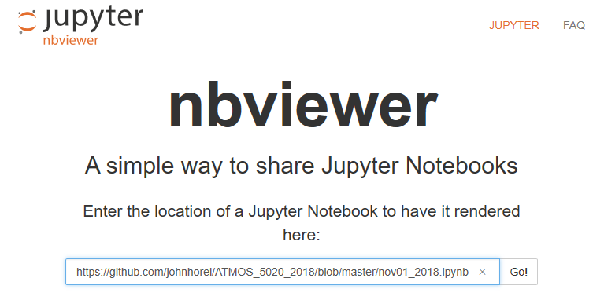

**Fall 2018**

# ATMOS 5020
Code and other information for ATMOS 5020, Environmental Programming, during Fall 2018

# Download this repository

    git clone https://github.com/johnhorel/ATMOS_5020_2018

or download the zip file.

    > If you have a Windows PC you will need to download git for Windows.

# View Jupyter Notebooks
Notebooks _should_ render on Github. If they don't, even after refreshing the page, you can copy the notebook URL and and view it with the nbviewer: https://nbviewer.jupyter.org/.

Alternatively, download the notebook by right clicking the 'raw' button and selecting 'save as' and then open the notebook in Jupyter Lab.

---

_Last edited by Brian_
