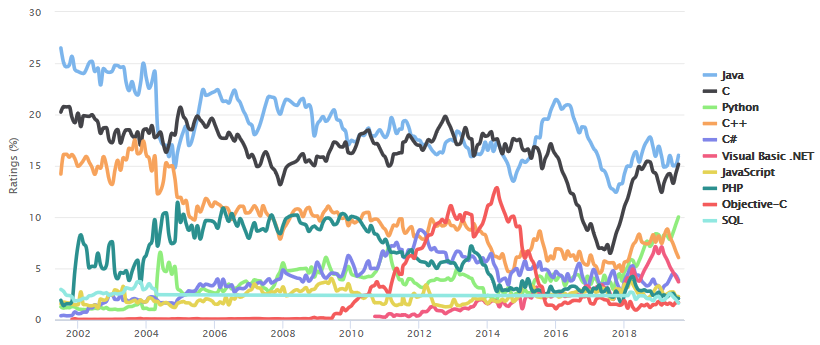

**September 3, 2019**  
**ATMOS 5020: Environmental Programming**  
**Brian Blaylock and John Horel**

> # Announcement: 
> ## Assignment #1 is due today.
> ## Check Your Understanding #3 is due September 10.

> # Today's Objective
> Introduce Python and give you the building blocks to do more exciting things later.
>
> > Who has the textbook?

# Introduction to Python (Chapter 1, 2, 3, 4)

> ## From _The Zen of Python_, by Tim Peters  
>Beautiful is better than ugly.  
Explicit is better than implicit.  
Simple is better than complex.  
Complex is better than complicated.   
Readability counts.  
>
>>To read the full _Zen of Python_, type `import this` in a Python terminal.

Python is a popular general-purpose computer programming language invented by the Dutch programmer Guido van Rossum in 1990.

Python has grown into one of the top 3 most-popular programming languages, ranked by usage: https://www.tiobe.com/tiobe-index/.

It is heavily used by many companies including Google, Dropbox, Netflix, Spotify, Facebook, Goldman Sachs, etc. and, of course, in environmental science. There have been many tweets about Hurricane Dorian today. Many of the graphics appear to be made with Python. 
[Here](https://twitter.com/TropicalTidbits/status/1168162318422859777) |
[Here](https://twitter.com/JohnMoralesNBC6/status/1168242646600617984) |
[Here](https://twitter.com/burgwx/status/1168683534309089281/) |
[Here](https://twitter.com/burgwx/status/1168607273868042240) |
[Here](https://twitter.com/RMS/status/1168633930930622467) |
[Here](https://twitter.com/mikarantane/status/1168794064675885056) |
[Here](https://twitter.com/JoshuaAlland/status/1168890718280212495) |

## Why use Python?
- Python software is **open source**, meaning that people can freely modify and share it.
- Python **syntax**, or the programing language's "grammar rules", is relatively intuitive compared to other languages. 
- Python Code can be easier to read due to formatting conventions. 
    - e.g., indented code blocks.
- Code is **interpreted** rather than **compiled**.  
    - Interpreted code runs slower, but is easier to write and debug.
- Python is relatively easy to learn. There is abundant documentation and learning material available online.
- More environmental science is being done in Python.
 - Python is object-oriented. Everything is an object. This makes coding very flexible but can also be confusing. We'll tend to use Python in a procedural-programming context that should minimize the confusion.

> ## A good read: [Why your first programming language doesn't really matter](https://www.techrepublic.com/article/why-your-first-programming-language-doesnt-really-matter/)

# Python 2 vs 3
Differences in coding are relatively minor but can create issues.
- Version 2.7 remains heavily used, but support for it is _rapidly_ being deprecated.
    - How much time is left? [Python 2.7 Retirement Count Down](https://pythonclock.org/)
- **Version 3.7**, or higher, is what you should be using.

We installed Python 3.7 on the first day of class.

> Note: When searching for online programming help, be aware of the two different versions and look for answers for Python 3.

  

---
---

# Terminology
You need to become familiar with terms used typically for all programming languages

| Term | Description | Example |
|--|--|--|
|Script|A file that contains one or more lines of Python code. Ends with the file exension `.py`.| `filename.py`
|Code| Program content 
|Package or Module or Library|Something you import that contains a collection of functions and methods that perform useful actions without writing the code yourself.|`import numpy`
|Statement| Instruction to a computer.| A line of code.
|Assignment| A statement that binds an expression (object) to a variable (name)| `=`
|Object| Anything that a variable can be referred to | a number, string, list, array, function, etc.
|Variable| Name of an assigned object. |
|Expression| Combo of numbers, text, variables, and operators that result in a new object when evaluated| `y = mx+b`
|Function| A block of statements used to create a new object
|Argument| A value passed to a function.| For the statement `max([1,9,5])`.  The object inside the `()` is the argument.
|Algorithm| Recipe for how to solve a problem
|Executable| File used to run a programs | `python`, `jupyter lab`
|Verification| Providing evidence that the program works correctly
|Debugging| Locating and correcting errors in a programs

[Reference: Python Glossary](https://docs.python.org/3/glossary.html)

  
# Interactive Python in the Classroom
Open the **terminal** or **xquartz**. On the command line, type the following commands, and pay attention to the output:

    which python

This command should tell you the location of the Python program `python`.

Now type:

    python

You are now in Python's built-in Interactive Development Environment (IDLE). You should see something like this:

    (base) atmoslab17:~ u0553130$ python
    Python 3.7.3 (default, Mar 27 2019, 16:54:48) 
    [Clang 4.0.1 (tags/RELEASE_401/final)] :: Anaconda, Inc. on darwin
    Type "help", "copyright", "credits" or "license" for more information.
    >>>

Press `enter` a few times. The bottom most `>>>` line, known as the prompt, is where you type code. Typing `enter` will run the code you type on that line.

## How to exit the IDLE
The next most important thing to know is how to exit Python. Exiting the IDLE depends on the version installed.
- `quit()`
- `exit()`
- `ctrl-d` or `ctrl-z`
- Type `quit` to see which ones apply.

Ok, now start Python back up in the terminal...

  
# Operators
You can use Python much like a calculator. Type the following statements and press `enter` to run the line of code:   
<!---->
    1+2
<!---->
    1/2
<!---->
    2**2
<!---->  
    5%2
> ## Do it yourself
> Try different numbers and find out what each of the operators do.
>- What does the `+` operator do?   
>- What does the `-` operator do?   
>- What does the `*` operator do?   
>- What does the `/` operator do?   
>- What does `//` operator do?  
>- What does the `**` operator do?  
>- What does the `%` "modulo" operator do?  

[Reference: Python Operators](https://www.tutorialspoint.com/python3/python_basic_operators.htm)

  
# Variables
In math/physics, variables are often part of equations/formulas. In computing languages, variables are much more flexible and can be assigned a value, then reused with a different value, etc.

Variables are names that values are assigned to with the `=` operator. In programing, `=` means "assigned to" _not_ "equals".

A variable is a value of some quantity, but to describe it requires:
- a name
- a storage location

Normally, the variable name references the stored value. Keeping the name and content separately allows the name to be used independently of the information it represents.

When a program executes, the name is bound by the computer source code to a value but the value of the variable may change during program execution.

|Rules for Variable Names| Example|
|--|--|
|Can be a combos of letters and numbers.|`alpha3`, `Timer8`
|Names are case sensitive.|`Pressure` is different from `pressure` and `PRESSURE`
|Must start with a letter.| Good: `var1 = 5`   Bad: `1var = 5`
|Can use underscores.| `potential_temperature`|
|Should be descriptive.| `temp` or `temperature` is better than `t`.|
|By convention, use all CAPS for constants:| `TEMP_0C_IN_K = 273.15`

> Note: There are 32 keyword names that are reserved becuase they have special meaning in Python. Variable names cannot be words like `del`, `and`, `if`, `global`, `for`, etc. 
>
>[Reference: Python Keywords](https://www.programiz.com/python-programming/keyword-list)

We can assign values to a variable and use the variables in expressions.

    # Calculate the hypotenuse of a triangle
    a = 3
    b = 4
    c = (a**2 + b**2)**(1/2)
    print(c)

 >Note: The `#` symbol indicates the line is a comment and not code. Everything in the line after the symbol is disregarded when the line of code is run.

## Do it Yourself
Try assigning a few variables and add the variables together.

    # Convert degrees Celsius to degrees Fahrenheit
    temp_c = 10
    temp_f = temp_c * 9/5 + 32

  
# Writing output to the terminal using the print function

A function is code provided to you or created that can be used many times in a program.  

One of the most basic funections is `print`
For example. Try `print(a)`

> NOTE: **This is a key difference between Python 2 and Python 3**. In python 2 you would not include parentheses. It would just be `print a`

  
# Data Types
Variables are **dynamically typed**. This means the type of variable (integer, float, etc.) is determined from the data assigned to that variable. (In some other languages, you have to tell the computer that `5` is an integer and not a string.)

Use the `type()` function to determine the type of a variable.

Different types of data can be stored in a variable. It is important to know the difference between the different types and how to convert one type to another.

    x = 1000      # An integer
    y = 10.4      # A float
    z = 'Utah'    # A string

    print(type(x))
    print(type(y))
    print(type(z))

## Integer Type
**Integers are whole numbers**, numbers with no decimal. They can have a value between `-2**31` and `2**31 - 1`

- The syntax of a programming language may allow for integers to be expressed as 16, 32, or 64 bits
- Most languages use **signed integers**, which means one bit is used to indicate negative vs positive numbers
- Integer variables can only describe integer values within the number of allowable bits: a signed 32 bit integer can lie only between -2,147,483,648 to 2,147,483,647
  
To convert a value to an integer, try:

    x = 5.333
    y = int(x)
    print(y, type(y))
    print(x, type(x))

## Floating Point Type
Floating points, or floats, are **numbers with a decimal**. 
- Approximates a real number over a wide range of values in terms of a specified number of significant digits and scaled using an exponent
- 64-bit binary floating-point number  (double precision) has 53 significant bits, an exponent of 11 bits, and one sign bit spanning from ~10308 to 10308
- How infinite is infinite (Inf, -Inf)? Not. We can’t define really tiny or really large #’s
- `Inf`- too large to represent as conventional floating-point values
- `1/0` = `Inf` or `exp(1000)`
- `log(0)` = `-Inf` (too small)
- `NaN` means not a number (0/0)
- Need to use Complex data type to express imaginary numbers: (try `sqrt(-1)`)

To convert a value to a float, try:

    x = 5
    y = float(x)
    print(y, type(y))
    print(x, type(x))

## String Type
**Strings are a sequence of characters** enclosed by single, double, or triple quotes. They can be words or numbers. You can convert an integer or float to a string with `str()`.

Try:

    'Hi'
    b = "Hello, I'm John"
    print(b)

    a = 'Go'
    b = 'Utes'
    print(a + ' ' + b + '!')

    # Convert a float to a string
    str(5.43)

> ## Do it yourself:
>- What happens when you try to convert a string to a float?
>   - Try: `float('5.1')`
>   - Try: `float('5')`
>   - Try: `float('hi')`

To format strings, use the format function.
    
    x = 9.356392
    y = 29
    print('The value of x is {}'.format(x))
    print('The value of y is {}'.format(y))
    print('The value of x is {} and the value of y is {}'.format(x, y))
    print('The value of x is {:.3} and the value of y is {:04}'.format(x, y))

String interpolation, or the string modulo `%` operator, is simpler!

    print('The value of x is: %s' % x)

The first string modulus % indicates the format of the variable after the second %

    x = '%6.1f is less than %3d' % (x, 10)
    print(x)

[Reference: Python String Formatting](https://kapeli.com/cheat_sheets/Python_Format_Strings.docset/Contents/Resources/Documents/index)  
[Reference: Python String Syntax](https://docs.python.org/3/library/string.html#format-string-syntax)  
[Reference: Python Strings](https://www.tutorialspoint.com/python3/python_strings.htm)

## None Type
If a variable is created but not assigned a value, then it has the None type.
   
    a = None
    print(a, type(a))

## Boolean Type

**A boolean is either `True`  or `False`**. 
  
- True is equivalent to 1 or 1.0
- False is equivalent to 0 or 0.0

Try: 

    bool(0)
    bool(3)
    bool(1-1)
    type(bool(1-1))

Booleans are often used with "comparison operators". Try:

    5 > 9           # Great than
    10 == 3         # Equal to
    12 <= 100       # Less than or equal to
    12 != 3.4       # Not equal to
    
    b = 3 > 8
    print(b)
    type(b)

### 🏈 Did Utah beat BYU last Thursday?

    # Utah and BYU scores by quarter
    Utah_q1 = 3
    Utah_q2 = 6
    Utah_q3 = 7
    Utah_q4 = 14

    BYU_q1 = 0
    BYU_q2 = 6
    BYU_q3 = 0
    BYU_q4 = 6

    Utah_final = Utah_q1 + Utah_q2 + Utah_q3 + Utah_q4
    BYU_final = BYU_q1 + BYU_q2 + BYU_q3 + BYU_q4

    print('Did Utah beat BYU last Thursday?')
    print(Utah_final>BYU_final)
    print('Final Score: Utah', Utah_final, '--','BYU', BYU_final)

[Reference: Python Comparison Operators](https://www.tutorialspoint.com/python3/comparison_operators_example.htm)

  
# Lists and Tuples
## Lists
A list is a collection of objects. A list is **mutable**, meaning that the contents of the list can be changed after it is created.

  - Contents of a list are enclosed by brackets `[]` and separated by commas.
  - Contents do not have to be of the same type. List items can be a mix of types.
  
Try:
  
    my_list = [9, -3.5, 'some', 'nothing', True, None, 5]
    print(my_list)

## Tuples
Pronunced _tewple_ and _tupple_. Are similar to lists, but are **immutable**, meaning that the contents can't be changed once it is created. You might use tuples for list of constants that you don't want the program to change.

  - Contents of a tuple are enclosed by parentheses `()` and separated by commas.
  - Contents do not have to be of the same type.

Try:

    my_tuple = ('many', 7, False, 'nothing', "hi", None, 10.55)
    print(my_tuple)

### 🏈 Did Utah beat BYU last Thursday?

    # Utah and BYU scores by quarter
    Utah = [3, 6, 7, 14]
    BYU = [0, 6, 0, 6]

    # sum() is a function that adds elements of a list or tuple if all 
    # contents of the list are integers or floats.
    Utah_final = sum(Utah)
    BYU_final = sum(BYU)

    print('Did Utah beat BYU last Thursday?')
    print(Utah_final>BYU_final)
    print('Final Score: Utah', Utah_final, '--','BYU', BYU_final)

## Accessing elements in a list or tuple
In lists and tuples, the first element is always the 0th item and the last element is always `-1`.

Try:

    my_list[0]
    my_list[1]
    my_list[-1]
    my_list[-3]

    my_tuple[0]
    my_tuple[1]
    my_tuple[-1]
    my_tuple[-3]

### 🏈 Did Utah score more than BYU in the 3rd quarter?

    # Remember, indexing starts at 0.
    # 3rd quarter scores are scored in the "2nd" index.
    Utah[2] > BYU[2]

You can also access consecutive items at once by a range of indices.  
Syntax: `my_list[beginning:end:interval]`, where the end index is _one integer greater than the index you want to access_.

  - Think of the beginning and end as boundaries of the elements rather than the index values themselves.
  - The interval (or stride) is optional.
  - The beginning or end (or both) can be omitted, which will return all of the elements relative to the remaining boundary.

Try:
    
    my_list[1:3]

    my_tuple[0:2]
    my_list[:]
    my_tuple[:-1]
    my_list[-2:]

> ## Question: Do you understand how indexing works?

By striding through a list you can skip over elements or reverse direction using the striding interval.

 Try:
    
    my_list[::2]
    my_tuple[::-1]
    my_list[1:6:2]

## Reassigning values in a lists
You can't change the value in a tuple, but you can change items in a list.

Try:

    a = my_tuple
    a[2] = 'test'

> ## Question: What happened?

Try:

    b = my_list
    print(b)
    b[2] = 'test'
    print(b)

> ## Question: Now what happened?

## Dictionary
Dictionaries are another useful ways to organize objects. Dictionaries are organized in a **"Key-Value pair"**. Keys can either be numbers or strings.

    my_dictionary = {1:'b',
                     2: [23,265,12,43],
                     3: ('this', 'is', 'a', 'tuple')}

    print(my_dictionary.keys())
    print(my_dictionary[1])
<!---->
    another_dictionary = {'name':'Brian',
                          'school': 'university of utah',
                          'hours in office': [8, 9, 10, 11, 12, 13, 14, 15]}
    print(another_dictionary.keys())
    print(another_dictionary['name'])
    print(another_dictionary['name'][0])
    # Notice how the key name can include spaces. This is just a string used to index the dictionary.

[Reference: Python Dictionary](https://www.tutorialspoint.com/python3/python_dictionary.htm)

  

---

# Practice Exercises 
You now know enough to perform some useful tasks in Python.

## 1. Save and run a script

Just like writing shell scripts, you can save Python code in a text file and run the code from the file known as a Python script. 

In a text editor, type several lines of Python code and include some print statements. Save the file as `my_script.py`. In the terminal, `cd` to the directory where the script is saved and run your script by typing the following:

    python my_script.py

You will notice that the program exits after it runs. If you want to run the script and stay in the interpreter, type `-i` before the name of the script to be in "interactive" mode:

    python -i my_script.py

  
## 2. Average Number Calculator
For this short exercise, we will make a simple "Average Number Calculator". Save this Python code to a text file called `average_score_calc.py`.

Note: the `input()` function asks for user input. This example converts the value to a float before it is stored in a variable.

    # Get three test score. Convert input from string to float.
    print("Calculate the average scores for three tests.")
    round1 = float(input("Enter score for round 1: "))
    round2 = float(input("Enter score for round 2: "))
    round3 = float(input("Enter score for round 3: "))
    
    # Calculate the average
    average = (round1 + round2 + round3) / 3

    # Print out the test score
    print("The average score is: ", average)

Run the program from the terminal (remember to `cd` to the same directory that the script is located in).

    python average_score_calc.py

  
## 2. Download Camera Images with Python
Download the python script `get_camera.py` from the GitHub page and run it. Look at the code and compare how it is different from the shell script we worked with last week.

    
---
---

> # Want more practice!
> Try this tutorial...https://www.tutorialspoint.com/python3/index.htm
> Try the codecademy python course. 
> The course for version 2 is free https://www.codecademy.com/learn/learn-python. 
> The version 3 course requires a subscription. That isn't necessary since python 2 and 3 are so similar. 
> Just be aware of the difference: 
>
> 
>
> Another resource: https://www.datacamp.com/courses/intro-to-python-for-data-science