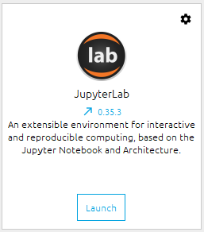

**September 5, 2019**  
**ATMOS 5020: Environmental Programming**  
**Brian Blaylock and John Horel**

> # Announcement: 
> ## Check Your Understanding #3 is due September 10.
> ### Today's Lab/Assignment #2: Read and work through **Chapter 5, 7** (more about this later, Due September 13th).

> # Today's Objective:
> 1. Use Python in a Jupyter Notebook.   
> 1. Introduce the Numpy library.  
> 1. Learn how to write if statements, loops, and functions.

# Python in a Jupyter Notebook  Chapter 4, 5, 7: Numpy, if statements, and loops

Last class we ran Python commands in the terminal and learned how to write and run Python scripts.

Today, we will use Python in a Jupyter Notebook.

## Open the Anaconda Navigator

Browser around and get familiar with it. Also, browse the [documents for Anaconda Navigator](https://docs.anaconda.com/anaconda/navigator/).

Anaconda is a **package manager**. There are many libraries built on Python that extend its capabilities. Anaconda helps you install and manage those packages. You can do all this in the command line, but we will do this with the GUI for this class.

Look at the environments tab. The "base" environment includes dozens of library packages that were included when you installed Anaconda.

# Python Notebooks & Jupyter Lab Environment
For the rest of the Python portion of the class, we will use _notebooks_ which allow for even more interactive exploration of Python programming.

## Open Jupyter Lab

A new window will pop up in your browser.

You can also open Jupyter Lab from ther terminal. Just type:

    jupyter lab

A **notebook** is an interactive document containing code, output, graphics, and text (markdown). The standard suffix for a notebook is `.ipynb` short for "interactive Python notebook" (in case you were wondering). 

We will use the [Jupyter Lab](https://youtu.be/ctOM-Gza04Y) environment to simplify viewing notebooks, writing and running Python code, and accessing other Python tools.

> If you look at a notebook file using a text editor, it will look odd with a lot of formatting structure. That is because a notebook is written as a [JSON](https://www.json.org/) file. JSON documents contain text, source code, rich media output, and metadata. Each segment of the document is stored in a cell. More to follow on JSON later. Don't sweat this detail now.

## How to view Notebooks

1. **GitHub**: _View only_  
You have already used the [class GitHub repository](https://github.com/johnhorel/ATMOS_5020_2018) to view class notes saved as markdown files. GitHub will also render Jupyter Notebooks, like this one.
2. **nbviewer**: _View only_  
Sometimes the GitHub rendition does not always work for one reason or another, even after refreshing. If this happens, copy the notebook's URL and open it in the [**nbviewer**](https://nbviewer.jupyter.org/).
3. **Jupyter Lab**: _View, create, edit, and run_  
Jupyter Lab is the program we will use to create, open, view, and edit Python notebooks.

# Explore Jupyter Lab
Familiarize yourself with the various menus in Jupyter Lab.

- Find the file explorer on the left menu.
    - How do you navigate folders and files?
    - What is a terminal?
    - What is a console?
    - What is a notebook?

## Create a new notebook
From the Launcher tab, create a new Python3 Notebook.

**Rename the notebook `my_first.ipynb`** 
- _How do you do that?_

Type some python statements in a "cell."

- `a = 5`
- `b = 10`
- `print(a+b)`

Run the commands in the cell by selecting the "play" button ▶ at the top or `shift+enter`.

> The `[*]` next to the cell indicates the cell is running. A number, `[1]`, indicates the cell was run and has finished. The number indicates the order the cells were run.

## How do you...
- edit a cell?
- insert a new cell?
- select a cell?
- run code in a cell?
- run all cells?
- change a cell from "code" to "markdown", and vice versa?

> What does 'restart the kernel' do?

> **Keyboard Shortcuts**: The keys `Shift+Enter` will run the selected cell.
>
> Reference: [Jupyter Shortcuts](https://github.com/johnhorel/ATMOS_5020_2018/blob/master/supplemental_docs/jupyter_shortcuts.md)  
> Reference: [Jupyter Notebook Documentation](https://jupyter-notebook-beginner-guide.readthedocs.io/en/latest/what_is_jupyter.html)

## Other functions
- Right click a cell to see what you can do with it.
    - Cut, copy, paste, split, merge, delete etc.
- Hover mouse over top tool bar icons to see what they do.
    - The kernel is where Python runs. If the kernel gets stuck running bad code, you might need to stop/restart the kernel.
- Create a second notebook and put it side-by-side the other notebook
    - Click and drag the tab to move the window next to the other tab.  

# Exercise: Tape Measure
From last class, type the tape measure code in a cell and run it.

    # How many total inches?
    inches = 38

    # Convert inches to feet and inches...

    # Use floor division to find out how many feet
    feet = inches // 12

    # Use the modulo operator to find the remainder
    rem_inches = inches % 12

    # Print results using modulo string formatting notation
    print('%s inches is %s feet and %s inches' % (inches, feet, rem_inches))

    # Print results using the "format" notation
    print('{} inches is {} feet and {} inches'.format(inches, feet, rem_inches))

Now change the value of inches to something else and re-run the cell.

---

> # Markdown in a notebook.
> Notebooks don't have to contain only code. You can change the cell type from "Code" to "Markdown" to format text to more cleanly document your code. It uses its own syntax to format the text (refer to this [Markdown Cheat Sheet](https://github.com/johnhorel/ATMOS_5020_2019/blob/master/QuickGuides/markdown-cheatsheet-online.pdf)), but you can also use HTML formating we learned earlier.

---

# Download and Open a Notebook from GitHub

1. Go to https://github.com/johnhorel/ATMOS_5020_2019/blob/master/Sept_05_2019.ipynb

1. Click the button that says "Raw" at the top right of the document. This is the json that makes up the document. 

1. Go back to the previous page.

1. Right click the "Raw" button and click "Save link as" or "Save target as" and save it to your Desktop.

1. Now open the document in Jupyter Lab.
