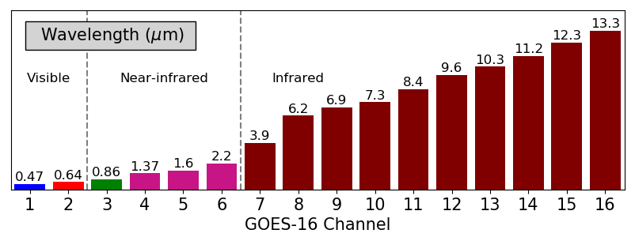
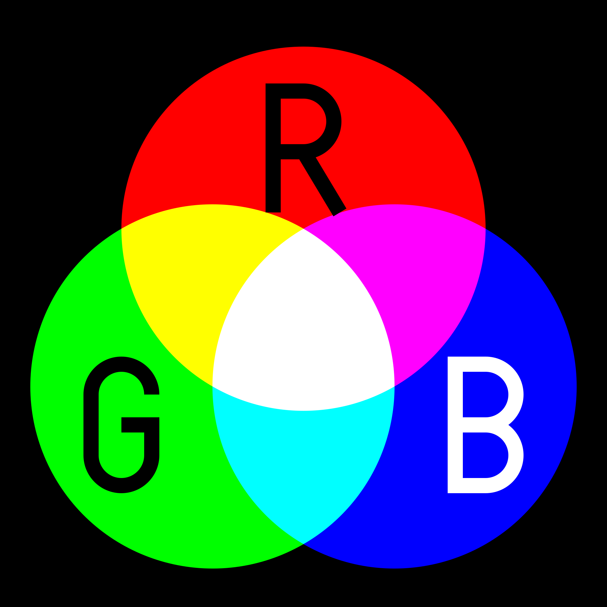

**August 20, 2019**  
**ATMOS 5020: Environmental Programming**  
**Brian Blaylock and John Horel**

> ### Today's Objective
> - Learn how to use Anaconda environments to download additional modules.
> - Complete in-class assignment to generate GOES-17 true color image.

> `cd` into the ATMOS_5020_2019 directory and do a `git pull` to update the class content with anything new.

# How to install new libraries in a new environment
As you get more programing experience and need to accomplish different kinds of tasks, you will need to install additional packages built to open certain types of datasets or perform specialized functions. So far, we have only used what came with Anaconda.

In the Anaconda Launcher, click on the "Environments" tab. Explore the packages you have downloaded, and search for ones that are "Not Installed."
- `xarray`
- `netcdf4`
- `cartopy`
- `metpy`

The _proper_ way to download these is in a new "environment". So far, we have only been using the "base" environment. We want to create a new environment  with the packages we need to look at GOES satellite data. 

## Create an environment from scratch:
1. In the environments tab, at the bottom, click `Create`, and name it "from_scratch". Select the python version to be 3.7.
1. Click the "channels" button, and add a new channel.
    - Type `conda-forge`, and then hit enter. This is the source of some additional libraries that aren't available in the default channel. ([What is conda-forge?](https://conda-forge.org/))
    - Then click "update channels"
1. Select packages we want to use in this environment:
    - `jupyter`
    - `jupyterlab`
    - `numpy`
    - `matplotlib`
    - `xarray`
    - `pandas`
1. Select from the dropdown to display the "Selected" packages (make sure the seach box is clear of text).
1. Now click, "Apply" in the bottom right corner. Anaconda will makes sure all the packages we want are compatible with each other.
1. After Anaconda has completed its checks to see what other packages need to be installed (dependencies), click "Apply" again to initiate the downloads. 
1. After the downloads complete, from the dropdown, show all the "Installed" packages to see what is there.

**To activate the new environment, click the name of the new environment so that a ▶ button appears.**

## Create an environment from a `.yml` file.
Use a text editor (VScode) to look at the file `environment_5020_class.yml`.  This is a file that specifies a list of packages we want to download. We aren't going to use everything in this, but they are some packages that I have used before. In the future, you can use this as a template to add-to or remove packages you do/don't need to create new environments.

1. Select "Import" and create a new environment from the file `environment_5020_class.yml`. Click the 📁 icon to upload the file.
1. This will download the modules specified in the file. It checks for dependencies (extra modules relied the packages rely on) and for compatibility between the versions.

**To activate the environment, click the name of the new environment so that a ▶ button appears.**

 

> ## Note: There are ways to do all of this through the terminal. [View the details here](https://docs.conda.io/projects/conda/en/latest/user-guide/tasks/manage-environments.html).

  

# 🌎 Look at Geostationary Operational Environmental Satellite (GOES) data

Often in programming, you will follow instructions to learn new abilities. 

For this class, we introduce you to some GOES-East data. Geostationary satellites observe the weather from ~35,000 km (22,000 miles) away. The [GOES-R](https://www.goes-r.gov/) satellite series is arguably one of the most exciting weather-observing platforms ever made. GOES-16 was made operational in 2017 and is also known as GOES-East. GOES-17 become operational in 2018 and is named GOES-West.

<big>**View data here: http://rammb-slider.cira.colostate.edu**</big>

The GOES-16 Advanced Baseline Imager (ABI) is a passive sensor that measures 16 different wavelengths of light. Every 5 minutes, the satellite produces a new image of the contiguous United States at ~2 km pixel resolution for each of the 16 wavelengths. Each wavelength has a scientific purpose. You will learn more about atmospheric absorption at different wavelengths in the atmospheric radiation class.

Each wavelength is called a "channel" and each channel. Look at the [ABI Reference Guide](https://www.goes-r.gov/mission/ABI-bands-quick-info.html) for more information about what each channel observes and its purpose. 

We are going to look at some data from the GOES-East and GOES-West satellite and create a True Color image.

# Color Images (RGB)

Color images on a screen are made of _Red_, _Green_, and _Blue_ light (RGB). If you don't believe me, check out this video: https://youtu.be/3BJU2drrtCM?t=446. Do you remember the [color picker](https://www.google.com/search?q=color+picker) used when customizing colors on your HTML page? 

Each RGB value is a number between 0 and 1 and controls the intensity of the Red, Green and Blue pixel on the screen. If `RGB=(0,0,1)` then you get a blue pixel. When RGB values are the same, e.g. `RGB=(0.5, 0.5, 0.5)`, then you get a shade of grey.

Since satelites measure different wavelengths of light, joining three different channels as an RGB will produce a color image. The trick is, knowing which channel to set as the R, G, and B values.

---

So far, we gave `imshow()` a 2D array to generate a plot. But if we give `imshow()` a 3D array with shape (M,N,3) then `imshow()` will produce an RGB raster. We can stack the R, G, and B array with `np.dstack()` to get an array with shape (M,N,3).

Reference: [plt.imshow()](https://matplotlib.org/api/_as_gen/matplotlib.pyplot.imshow.html)

  

# In-Class Assignment:

**Do all this work in a new notebook and upload it to Canvas at the end of class.**

---

## Plot GOES-17 data for a date of interest

1. Look at this document, that gives us the recipe for creating a "true color" image. cimss.ssec.wisc.edu/goes/OCLOFactSheetPDFs/ABIQuickGuide_CIMSSRGB_v2.pdf

1. Download a GOES-16 or GOES-17 file:
    - Go to this webpage: http://home.chpc.utah.edu/~u0553130/Brian_Blaylock/cgi-bin/goes16_download.cgi?source=aws&satellite=noaa-goes17&domain=C&product=ABI-L2-MCMIP&date=2019-09-19&hour=18
    - (make sure you download an hour for when you expect daylight)

1. Follow the instructions on the following webpage to plot the data you downloaded:
http://unidata.github.io/python-gallery/examples/mapping_GOES16_TrueColor.html#sphx-glr-examples-mapping-goes16-truecolor-py

    - Ask questions throughout to figure out what you are doing.
    - **Change the file name to the one you downloaded.**

    - Print out the value of variables to look at the data it contains.
        - What is contained in the variable `C`
        - What do you get when you type `C.instrument_type`
        - How do you find the "Spatial Resolution?"
        - How do you find the wavelength of each band?
        - Where is the observed data stored?
        - What does `C['CMI_C01'].plot()` do? (this is function built into xarray)
    - What things can you change?
        - Can you zoom-in on Texas and look at the clouds from the tropical depression Imelda?
        - Look at each of the different channels. Make a gray scale image by setting all RGB values to the same channel number (for channels 1-6).
        - Save the image with `plt.savefig(name_of_figure)`

**Work through at least to the point where you make the map of Utah.**

   
Something extra to try:

# Plot All Channels
Using subplots, we will plot all the GOES-16 channels in a single image. This method for plotting is slightly different than what we have used so far. We have to access each subplot axes object.

If you need to, refer back to the notes about `for loops`.

`enumerate()` is a handy function when you are using for loops. 

Reference: [enumerate()](https://docs.python.org/2/library/functions.html#enumerate)

    # Generate a figure with 4X4 subplots (16 total axes).
    fig, axes = plt.subplots(4,4, figsize=(18,12))
    print('Axes Shape:', np.shape(axes))

    # Flatten the array of axes objects so we can iterate over each
    axes = axes.flatten()
    print('Axes Shape:', np.shape(axes))

    # For each of the 16 axes, plot a different GOES-16 ABI channel.
    for i, ax in enumerate(axes):
        # i is the iterator number, ax is an object in the axes array
        print('opening channel', i+1, 'and plotting it on', ax)
        
        # Open the channel data file (i+1 since the first channel, channel 1, is the zeroth index)
        channel = C['CMI_C%02d' % (i+1)]
        
        # To plot on a specific axes, we need to tell python which area we want to work with.
        # plt.sca(axes_name) is used to 'set current axes'. Each loop iteration we will set a different axes to plot on
        plt.sca(ax)
        
        # Some channels have units of "Kelvin" and others have units of 1 which stands for reflectance value between 0 and 1. 
        # Plot the two types of data differently
        if i+1<7:
            plt.imshow(channel, cmap='gray')
        else:
            plt.imshow(channel, cmap='cubehelix_r')
        plt.colorbar(orientation='horizontal', pad=0, shrink=.95)
        plt.title('Channel: %s (%s um)' % (i+1, C['band_wavelength_C%02d' % (i+1)].data[0]), loc='left')
        #plt.title('%s' % (channel['units']), loc='right')
        plt.axis('off')

