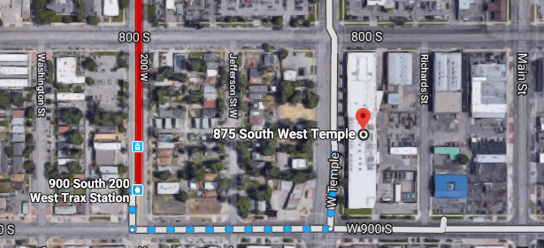
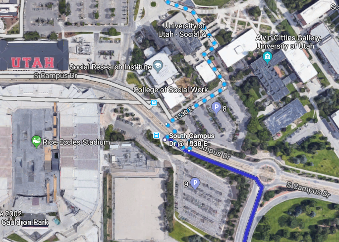
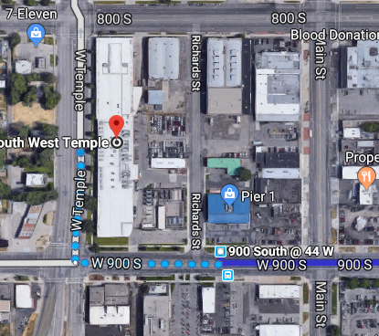
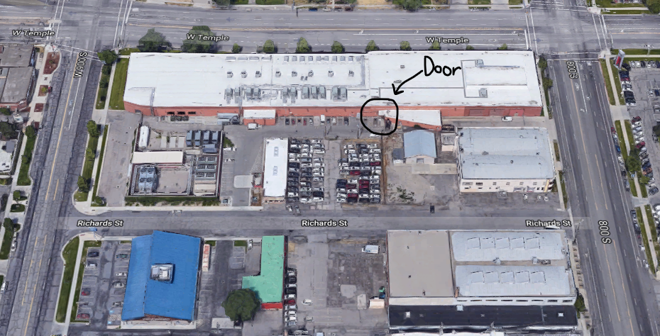
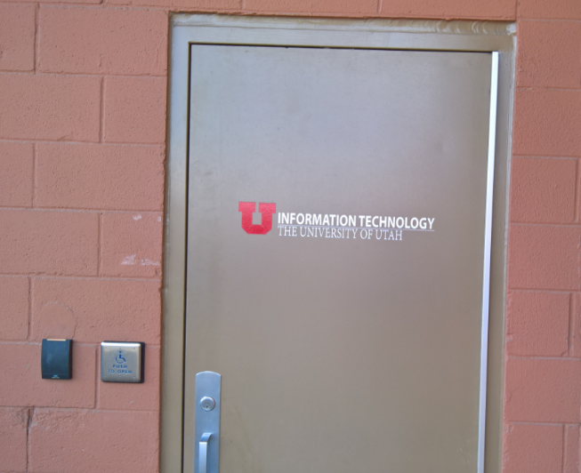
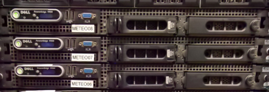

**November 1, 2018**  
**ATMOS 5020: Environmental Programming**  
**John Horel & Brian Blaylock**

# Downtown Data Center Tour

<big style='color:red;font-family:arial'>**YOU MUST BRING A VALID PHOTO ID**</big>

|-|-|
|--|--|
|**Date**| November 1, 2018|
|**Time**| 2:00 - 3:00 PM|
|**Where**|Downtown Data Center **875 West Temple, Salt Lake City, UT 84101**  Access from Richards St (50 West) South of 8th South|

# How do you get there?
The Downtown Data Center is located in the old Coca-Cola building, built in 1938.

From the Marriott Library, you can take either the `Red Line TRAX` or `Route 9` to arrive at the data center by 1:45 PM.

<big>[**Directions: Google Maps**](https://www.google.com/maps/dir/40.7623179,-111.8464801/875+S+W+Temple,+Salt+Lake+City,+UT+84101/@40.7528203,-111.9013535,13490m/data=!3m1!1e3!4m13!4m12!1m0!1m5!1m1!1s0x8752f522c5656855:0xf768d9edac42e409!2m2!1d-111.8934687!2d40.7508439!2m3!6e1!7e2!8j1541080440!3e3)</big>

#### Red Line: To Daybreak (about 30 minutes)
- Depart from Stadium TRAX stop at `1:25 PM`
- Get off at 900 South 200 West TRAX Station.
- Walk east (one full block) to the data center.
- Access front door from Richard's Street.
- Arrive at ~`1:45 PM`

#### Route 9: To Central Point Station (about 25 minutes)
- Depart from South Campus Drive and 1530 E at `1:19 PM`
- Get off at 900 South and 44 West.
- Short walk to the data center.
- Access front door from Richard's Street.
- Arrive at ~`1:34 PM`.

The entrance is on the east side of the building. By design, the front door is hard to find.

As of last year, this is what the entrance looked like...

# Why are we going?
The Downtown Data Center is where the University of Utah, University Hospital, and the Center For High Performance Computing (CHPC) house their computer resources. Many research groups at the university, including all the atmospheric science research groups, do their work on these computers. When you log onto `meteo07@chpc.utah.edu`, you are accessing one of many computers located at this facility.

During the tour, you will see the computer you log into for class, see lots of wires and flashing lights, and learn a little about how a supercomputer facility works. Be ready to ask questions and soak in the knowledge!

