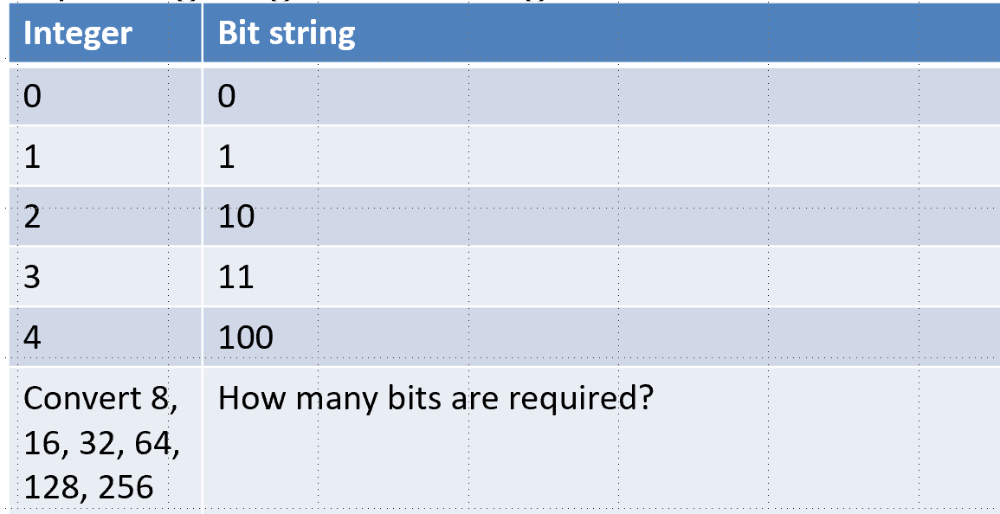

**October 18, 2018**  
**ATMOS 5020: Environmental Programming**  
**John Horel & Brian Blaylock**

# Objectives
- Introduce concept of programming languages
- Review basic Linux commands
- Edit short shell scripts

# Programming languages
Programming is a way to pass instructions to a computer. Each  language has its own syntax (form) and semantics (meaning).
- **Syntax**: Sequences of text including words, numbers, and punctuation using rules like written languages (grammar).
- **Semantics**: The meaning given to the syntax - a sequence of words that makes sense to a computer.

# Compiled vs. Interpreted Languages
Compiled

- Translates the language syntax (source code) to machine code before executing the program
- Create a binary executable that is “run”
- C and Fortran are compiled languages
- Compiled codes typically take less time to complete
- Usually requires recompiling on different platforms: Linux vs. PC

Interpreted

- Executes source code directly translating statements using code snippets already compiled in machine language
- Create and run a script that executes instructions
- Java, python, perl, and Julia are interpreted languages
- Tend to be slower but also more platform independent

# Integrated Computing Environments
**Matlab (MATrix LABoratory)** - commercial product built initially to simplify learning Fortran and later rebuilt using C
- Don’t have to declare variable type, handles matrix math handily, etc.

**IDL (Interactive Data Language)** - commercial product layered on Fortran, later using C
- Very useful for image processing

**Jupyter notebook/lab** -  open source environments for scientific programming in Python
- Web browser interface for running Python, R, and Julia

**R** - open source environment for statistical computing and graphics

# Keeping track of the numbers
- Bits: Binary digITs (two bits: 0 or 1)
- Byte: 8 bits
- 32 or 64 bit words
- Combinations of bytes and words often expressed as hexidecimals (base 16)
- Computers use bits; humans use base 10
- Computer program required to translate from/to base 10

# Converting numbers to bits
Computers know only about strings of 0’s and 1’s

### Expressing integers as bit strings


  - Look online: What number is defined by a string of  16 1’s? 32 1’s? 64 1’s?
  - Look online: What number can be defined by a string of 31 1’s? why might we “lose” 1 bit?

# Languages tend to use similar syntax
Once you learn 1 language, it becomes easier to learn others. For example, text is defined as sequences of 8 bit (1 byte) strings (see http://www.ascii-code.com/)
- How do you know whether a bit string represents a number or a character?

Language defines syntax for different types of “variables” or “data types”: character, integer, float.

A variable of data type “character” can be assigned a length: so a 20 character variable is 20*8= 160 bits

# Variables
In math/physics, variables are often part of equations/formulas. In computing languages, variables are much more flexible and can be assigned a value, then reused with a different value, etc.

A variable is a value of some quantity, but to describe it requires:
- a name
- a storage location

Normally, the variable name references the stored value. Keeping the name and content separately allows the name to be used independently of the information it represents.

When a program executes, the name is bound by the computer source code to a value but the value of the variable may change during program execution.

Variable names should be descriptive: `temp_air` is better than `t` or `ta` Depending on the language, `t` and `T` may or may not refer to the same variable because some languages are case sensitive (python, C) and others are not (Fortran).

# Data Types

## Integer Data Type
Integers are whole numbers.

- The syntax of a programming language may allow for integers to be expressed as 16, 32, or 64 bits
- Most languages use **signed integers**, which means one bit is used to indicate negative vs positive numbers
- Integer variables can only describe integer values within the number of allowable bits: a signed 32 bit integer can lie only between -2,147,483,648 to 2,147,483,647

## Floating Point Data Type
Floating points, or floats, are numbers with a decimal. 
- Approximates a real number over a wide range of values in terms of a specified number of significant digits and scaled using an exponent
- 64-bit binary floating-point number  (double precision) has 53 significant bits, an exponent of 11 bits, and one sign bit spanning from ~10<sup>308</sup> to 10<sup>308</sup>
- How infinite is infinite (Inf, -Inf)? Not. We can’t define really tiny or really large #’s
- `Inf`- too large to represent as conventional floating-point values
- `1/0` = `Inf` or `exp(1000)`
- `log(0)` = `-Inf` (too small)
- `NaN` means not a number (0/0)
- Need to use Complex data type to express imaginary numbers: (try `sqrt(-1)`)

# Logging onto the Mac
- Username and password are the ones you use for Canvas, CIS, umail, etc.
- Wait a long time…
- When menu shows at the bottom, click on the left most: Finder
- Look under Applications
  - Utilities
    - Terminal
    - XQuartz
    - Atom
  - Programming
  - Science and engineering

> ## CHPC resources
> - http://chpc.utah.edu
>- https://www.youtube.com/watch?v=0EYrzOKtuBg
> - https://www.youtube.com/watch?v=hP2GDWCTKg4
>
> ## Linux resources
>Dozens of books and online resources
>- http://www.ee.surrey.ac.uk/Teaching/Unix/
>- http://heather.cs.ucdavis.edu/~matloff/unix.html
>- http://searchdatacenter.techtarget.com/tutorial/77-Linux-commands-and-utilities-youll-actually-use

# File manipulation

|||
|--|--|
|`cp file1 file2`|  copies file1 to file2
|`cp file1 dest_directory/`|  copy file1 to the specified existing directory
|`cp * dest_directory/`|     Copy all files in current directory to dest
|`cp -r directory1 dest_directory/`|   Recursively copies files from directory1 to the dest_directory
|`mv file1 new-file`|         renames file1 as new-file
|`mv file1 dest_directory/`|  moves file1 to the specified existing directory


Removing files and directories  
**There is no undelete! Be careful!!!**

|||
|--|--|
|`rm -i file`| Interactive removal (option –i) of specified file. User must answer yes or no before deletion.
|`rm -r directory`| Don't DO THIS! A recursive deletion of all files within the specified directories and the directory


# For reference: Unix Users
Unix distinguishes permission for three different types
- User (u)
- Group (g)
- Others (o)

Check permissions with `ls –l`
- `drwxrwxrwx` (directory, ugo all have read, write, and execute privileges)
- `-rwx------` (file and only the user can rwx the file)
- `-r--r--r--` (file with only read permissions for everyone)

 Use `chmod` command to change file permission

|||
|--|--|
|`chmod ugo +rwx file`|  Gives everyone (user, group and others) permission to read, write, and execute file
|`chmod o -wx file`| Remove permission by others not in group to write or execute a file


# Exercises 

## I want to…
1. Open a terminal window using Xquartz or Terminal application
1. List the files in my Desktop folder
    - Do you use `cd`, `mv`, or `ls`?
1. Make a subdirectory on the Desktop named `oct_18`
    - Do you use `cd`, `ls`, `mkdir`, or `cp`?

## I want to…
1. Return to my home directory
    - what command is simplest to use?
1. List the subdirectories (and files) there and save them to a file named `files.txt`
    - how do you do that?
1. Move the file to my `oct_18` directory (you can either copy or move them- what’s the difference?) and give the file a new name `files_2.txt`
    - how do you do that?
1. Verify that the file is in that directory and see the date the file was modified and have the files sorted in reverse order
    - how do you do that? There are a couple of ways to do that

## I want to…
1. See who is logged onto the computer
    - `who`
1. See a list of all the commands I’ve typed
    - `history`
1. Return the current time
    - `date`
1. Repeat the last command
    - ``!!``

## I want to

Create a directory accessible on the CHPC web server

1. Log onto the `meteo07.chpc.utah.edu` server (or `meteo08.chpc.utah.edu`)
    - `ssh –l uXXXXXXX –Y meteo07.chpc.utah.edu`
      - replace the X's with your unid
      - (the `–Y` allows secure x11 forwarding for graphics)
    - type `yes` when prompted to do so
1. Make a new directory called `public_html`
    - `mkdir public_html`
1. Go to that directory
    - `cd public_html`
1. Make a directory called `5020`
    - `mkdir 5020`
1. Copy a file of precipitation data from Utah
    - `cp ~u0035056/public_html/5020/utah_precip_oct.csv .`
      - the `.` at the end indicates the directory I am currently in
      - The syntax you are using to copy the file: `cp [file from here] [put it here]`
1. Look in your new web directory using a browser
    - http://home.chpc.utah.edu/~uXXXXXXX/5020/
        - Replace the X’s with your unid
    - What is there now in your directory?
    - Files you put in this `public_html` directory--like images, HTML, etc.--are accessible by you and others by the web.

> **How do I log onto CHPC resources on my Windows PC?** [Use Putty and Xming](./supplemental_docs/putty.md).

## I want to
1. Look at the precipitation data from Utah from Oct 1 - 9
    - `more utah_precip_oct.csv`
1. Sort the file so that the highest values are at the top and save the output to utah_precip_oct_sort.csv
    - `sort –r utah_precip_oct.csv > utah_precip_oct_sort.csv`
        - Is it sorted correctly?
        - What does the `–r` modifier do?
- Try this:
  - `sort –r -g utah_precip_oct.csv > utah_precip_oct_sort.csv`
  - Is that better? Why?
  - Do a `man sort` to read the documents.

# Running linux commands with shell scripts
Often, we want to execute commands more than once and have a record of how we did it.

When a group of commands has to be executed regularly, we can store them in a file and execute those commands from the file. Such files are called **shell scripts**, **shell programs**, or **shell procedures**.

There is no restrictions on file extension, but to denote a tcsh-shell script it is best to use the extension `.csh`.

Copy a shell script to your directory

    cp ~u0035056/public_html/5020/first.csh .

Look in this file
- `more first.csh`
- `chmod +x first.csh` (what does this do?)
- `./first.csh` (what happened?)
    - The `./` indicates to look for the scrip in the current directory.


No compiler is required to run a shell script, because the UNIX shell acts as an interpreter when reading script files.

After you create a shell script, you simply tell the OS that the file is a program that can be executed, by using the chmod command to change the files’ mode to be executable.

Shell programs are slower than compiled programs, because the shell must interpret each UNIX command inside the executable script file before it is executed.

# Looking at web cam images
Go to  http://home.chpc.utah.edu/~u0790486/wxinfo/cgi-bin/uunet_camera_explorer.cgi

Click on the image and look at the web page location: http://meso1.chpc.utah.edu/station_cameras/wbbw_cam/wbbw_cam_current.jpg

We want to save those images and post on a web page.

Copy a scripts from the class directory to your own public_html class directory

    cp ~u0035056/public_html/5020/camera.csh .
    chmod +x camera.csh
    more camera.csh
    ./camera.csh

What happened?

# Examining the shell script
Grabbing camera images: `camera.csh`

|||
|--|--|
|`#!/bin/tcsh`| indicates a tc shell
|`set ctr = 0`| assign a value of 0 to ctr
|`#going to loop 3 times`| `#` indicates a comment
|`while ( $ctr < 3 )`|  loop while ctr is less than 3 (0,1,2)
|```set file = wbbw_`date -u +%Y%m%d%H%M%S`.jpg```| we are using the date function in a specific time string format and set the variable file to a string
|`echo grabbing wbbw image no $ctr`| writing to the terminal before getting the image
|`curl "http://meso1.chpc.utah.edu/station_cameras/wbbw_cam/wbbw_cam_current.jpg" -o $file`| using the function curl to get the image from a directory and save it to a file named file1. Type `man curl` to see what curl is about.
|`sleep 10`| wait 10 seconds before grabbing the next image
|`@ ctr++`| increment the counter from 0 to 1 to 2 and then it'll stop
|`end`| the end of the while loop


# Look in your web directory using a browser
- http://home.chpc.utah.edu/~uXXXXXXX/5020/
    - Replace the X’s with your unid
- What is in your directory now?

# Let’s do something!
How do you switch in the shell script to the Bonneville Salt Flat camera?

Let’s do it on your Mac, not on the meteo07 computer.
- Go to: http://home.chpc.utah.edu/~u0790486/wxinfo/cgi-bin/uunet_camera_explorer.cgi
- Shift to the BFLAT camera and then click to the image
- What needs to be changed about the `curl` line in terms of the directory and file name?
- Download the camera.csh file from your web page to your mac into your Desktop directory

# Editing files in Unix
- Choice:
  - edit on remote server that you will be running the program or…
  - edit on local computer and upload or run the program remotely from your local computer
- Choice:
  vim (NOT WYSWYG) vs. emacs: arguments galore on the “best” editor
- vim - proper indents for python, etc.
- Lots of other powerful editors- On Mac’s: Atom, TextEdit, TextWrangler, etc.
- Your choice - vim is old school, but always there

## VIM (old school)
- vim session begins by invoking the command “vim” with or without a filename.
- you will get a full empty screen (vi), each line led with ~
- last line in the screen reserved for commands that you can enter to act on the text as well as used by the system to display messages
- http://unix.t-a-y-l-o-r.com/Vi.html
- https://www.chpc.utah.edu/presentations/vi_CheatSheet-2.pdf

## Modern Editors (newer school)
- Lots of other editors on Mac’s: TextEdit, TextWrangler, etc.
- Use the Finder on the Mac to find TextWrangler application
- Open the file camera.csh in TextWrangler
- Change the line:
  - `curl "http://meso1.chpc.utah.edu/station_cameras/wbbw_cam/wbbw_cam_current.jpg" -o $file`
- To
  - `curl "http://meso1.chpc.utah.edu/station_cameras/bflat_cam/bflat_cam_current.jpg" -o $file`
- Save the file as camera_bflat.csh
- Run the script
`./camera_bflat.csh`
- Did it work? Do you have camera images in your Desktop directory?
- Now change the assignment of the name of the camera images from wbb_w to bflat

# Copying a file to your unix public_html directory from your Mac

We want to copy `camera_bflat.csh` to your `public_html/5020` directory in your CHPC account. The `scp` command stands for "secure copy." 

    scp camera_bflat.csh uXXXXXXX@meteo07.chpc.utah.edu:public_html/5020

- Verify by looking in your CHPC public_html account (use commands like `cd public_html` and `ls`) that the file you copied is there.
- Go to your meteo07 terminal window and run the camera_bflat.csh script
  - `./camera_bflat.csh`
` Go to your web page (chpc.utah.edu/~uXXXXXX/5020) and view the images.


# For reference - vim text editor:
Command mode
- pass commands to act on text
- can not use this mode to enter or replace text
- press the i key to shift to Insert mode
- [Esc] to revert back to Command Mode
- Every key pressed is interpreted as a command to run on text
- Navigation, copying, deleting text are performed in this mode
- To move cursor, use arrow keys or l (right), h (left), j (down), k  (up)

Line mode:
- save file, switch to another file, make a global substitution in the file.
- Enter instructions in the last line of the screen
- Press “ESC” &  “:”
- command “:wq” will save the current file and quit vi

Insert Mode: Invoke this mode by pressing on of the following keys
- `i` – insert text to the left of the cursor
- `a` – appends text to the right of the cursor
- `I` – insert text at the beginning of the line
- `A` – appends text at the end of the line
- `o` – opens line below
- `O` – opens line above
- Replace (r, R, s, S) at each line <Enter>
- backspace to wipe out unwanted text
- The entered text is not saved in the insert mode but in command mode

Saving text and exiting vim
- `:w` – save and continue
- `:w anotherfile` - saves file to another filename
- `:x` and `:wq` – save and exit
- `:q` and `:q!` – abandon all changes and quit (do not save)

Editing text
- Deleting Text
  - `x` – deletes one or more contiguous character
  - `X` – deletes to the left
  - `dd` – deletes the current line
- Paste
  - after `yy`; `p` will paste the lines
- Undoing Last Editing
  - `u` – will undo the last change
- Substitution – Search and Replace (:s)
  - 1,$s/double/float/g
  - 1,50s/unsigned//g

# Today’s Objectives

- Introduce concept of programming languages
- Review linux basic commands
- Edit short shell scripts
- Check Your Understanding #1 due Friday
- Check Your Understanding #2 due Tuesday
- Assignment 1 worked on next week
