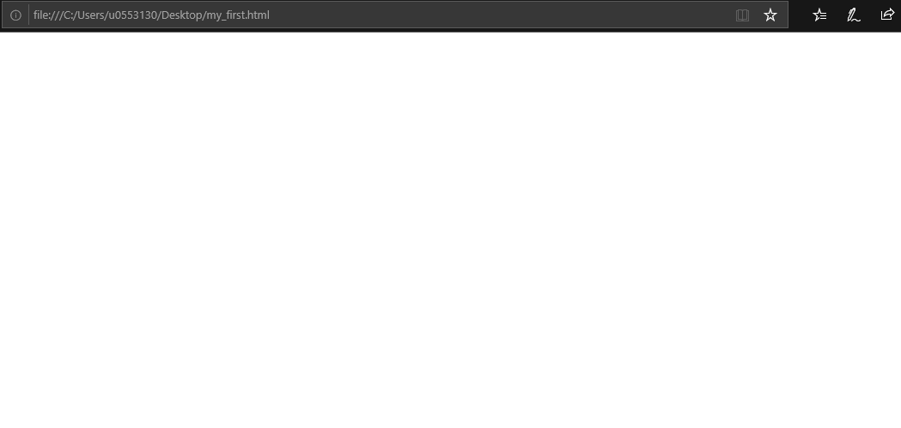
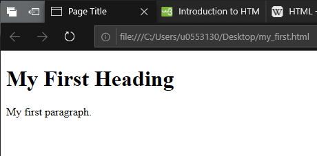
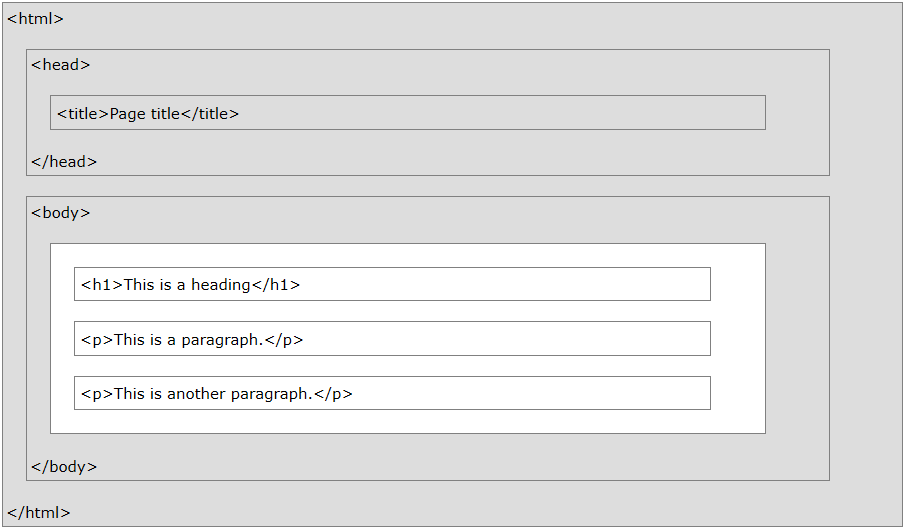

1. Go over privileges `chmod` ([see tutorial](https://www.tutorialspoint.com/unix_commands/chmod.htm))
1. Introduce editing files on CHPC with `gedit`. (Be grateful we aren't making you use `vi` for anything.)
    - Open xquartz
    - Log onto meteo07: `ssh -Y uXXXXX@meteo07.chpc.utah.edu`
    - Type: `gedit` for a handy text editor GUI.
1. How to log onto CHPC resources from a Windows PC: [Use Putty and Xming](./supplemental_docs/putty.md).

 

 

**October 25, 2018**  
**ATMOS 5020: Environmental Programming**  
**John Horel & Brian Blaylock**

# Introduction to HTML 🌐
Information is bountifully shared on the web. Hypertext Markup Language (HTML) is the language that webpages are written in. When you navigate to a webpage, your browser receives a HTML document, interprets each line, and renders the text, graphics, buttons, etc. to your screen. In most browsers, you can look at the raw HTML text used to render the page by right clicking the page and selecting "view source."

> ### Give it a try! 
> Right click this or another webpage and click `view source`. Look at the HTML text that the page is rendered from. What do you see?

HTML is primarily responsible for how the page looks. The scope of this class (one day of web development) is limited to writing very basic HTML pages. On your own or in another class, you can learn how a page's style can be controlled with Cascading Style Sheets (CSS) and how to use JavaScript to perform actions on the page, like performing an action when a button is clicked.

**The objective for today is to write a basic HTML document and put it online for anyone to access.**

Making web pages is fun! Like anything else, learning HTML requires practice by doing. There are many online materials for learning HTML, but the W3 School tutorials are, in my opinion, the best. One good way to learn is by copy and pasting other people's code and figuring out what it does. You'll find all sorts of cool little code snippets online that you can try and use.
- <big>[**References: W3 Schools HTML Tutorial**](https://www.w3schools.com/html/)</big>  
- [References: Tutorials Point HTML Tutorial](https://www.tutorialspoint.com/html)

# Create an HTML file
Open a text editor and create a new file. Save the file as `my_first.html`. HTML files always have the suffix `.html` or `.htm`.

In the file explorer, double click the file or right-click and select `open in [browser]`. The file when opened in the browser will show only a blank screen. This is expected because the file doesn't have anything in it.

# Basic HTML Structure
When you write a paper or essay there is a **beginning**, a **middle**, and an **end**. Each paragraph within the paper also has a beginning, middle, and end. Writing HTML is much like writing a paper--each element of the HTML document needs a beginning, a middle, and an end. The beginning and end of elements are marked with **tags**. Different tag types tell the browser to render different elements on the screen. Page elements include paragraphs, headers, images, hyperlinks, tables, lists, videos, etc.

Tags are used in pairs (the beginning and end) and surround the content they refer to (the middle). The first tag is called an **opening tag** and the last tag is called a **closing tag**. Notice in the example below that the closing tag has a `/` in it before the tag name.

    <tag_name> The content to display </tag_name>

## Skeleton HTML 🎃
The following is a bare-bones HTML page. Type this in your `my_first.html` document and refresh the page in your browser. Notice how tags can be nested.

    <!DOCTYPE html>
    
    <html>
    <head>
    <title>Page Title</title>
    </head>
    <body>

        <h1>My First Heading</h1>
        
My first paragraph.

    </body>
    </html>

> Note: HTML does not require specific line spacing rules, but line spacing is carefully used to increase the file's readability.

#### What does each line do?  
- `<!DOCTYPE html>` is always the first line of an HTML file. It tells the browser that the file is an HTML document. **There is no closing tag**. 
- `<html>...</html>` indicates everything in the middle is HTML content.
- `<head>...</head>` contains metadata for the page. Notice that the name of the page in the browser tab changed. The content of `<head>` does not display anything directly on the page. You will also see that it is used to load CSS style sheets, JavaScript, and other page dependencies.
- `<body>...</body>` is the main part of the page where the page's content that you see on the screen is located.
- `<h1>...</h1>` is a header.
- `
...
` is a paragraph.

The image below illustrates how the tags are nested in each other to make a page. The content of the white box is shown on the page while the parts in grey are hidden from what is shown on the screen.

> ### HTML Comments
> It is _always_ good practice to comment your code. Comments are lines of code that are skipped by the program reading the code. In HTML you denote a comment with the special tag `<!-- -->`.
>
> `<!-- This is a Comment -->`

## Some Basic Tags

|Tag|What it does|
|--|--|
|`<h1>`| Header. These are used by search engines to understand how the content on the page is organized. Other headers are `<h2>`,`<h3>`,...`<h6>` to indicate less important sections. _Do not use headers to just make text bigger!_|
|`
`| Paragraph|
|`<b>`| <b>Bold</b> text|
|`<u>`| <u>Underline</u> text|
|`<i>`| <i>Italicize</i> text|
|`<Subscript>`| Subscript text|
|``| Superscript text|
|`<strike>`| <strike>Strike through</strike> text|
|`<mark>`| <mark>Highlight</mark> text|
|`
`| Inserts a horizontal line across the page to separate content. **No closing tag**.|
|` `| Insert a line break. **No closing tag**.  |

## Tag Style Attributes
Style attributes change how the contents of the tags look, e.g. color, font size, etc.

    <tag style="property:value"> Content </tag>

For example, if I wanted to make text in a paragraph green, I would do

    
 This paragraph text will be green.

Some basic styles for text-based elements include:
- `background-color`, changes background color
    - [Common names](https://www.w3schools.com/colors/colors_names.asp), RGB: `rgb(#, #, #)` or HEX: `#000000`.
- `color`, changes color of text
    - [Common names](https://www.w3schools.com/colors/colors_names.asp), RGB: `rgb(#, #, #)` or HEX: `#000000`.
- `font-family`, changes the font of text
    -  verdana: `style="font-family:verdana;"`
    -  courier: `style="font-family:courier;"`
    -  agency fb: `style="font-family:agency fb;"`
    -  arial: `style="font-family:arial;"`
    -  Tw Cen MT: `style="font-family:tw cen mt;"`
    -  Garamond: `style="font-family:garamond;"`
    - [more](https://en.wikipedia.org/wiki/Font_family_(HTML))
- `font-size`, changes the font size as a percent or a pixel size
    - `style="font-size:800%;"`
    - `style="font-size:20px;"`
- `text-align`, moves text to left, center, or right
    - `style="text-align:center;"`
    - `style="text-align:right;"`
    - `style="text-align:left;"` (default)

## Quick note on color

There are some predefined color names, but you have more control over the exact color you want by using HEX or rgb values. Use [Google's color picker](https://www.google.com/search?q=color+picker) to generate the RGB or HEX value of custom colors.

For example: 

    style='color:#4286f4'
    style='color:rgb(0, 155, 62)'
    style='color:blue'

## Apply style to part of an element with ``

The `` tag, while it doesn't add any elements to the content, style attributes can be applied to it. You might want to use it when you want to apply style to a section of a paragraph or header, rather than the whole header.

    <h3>Last word will be  blue and big </h3>

    
Just make  this  word green.

---

> ### Try it yourself!
> Add some more text to your document and format it with different tags and style attributes.

---

## Hyperlinks
Hyperlinks are clickable text that navigate the browser window to a new location. It uses the `<a>` tag, which stands for "anchor." 
    
    <a href='https://www.google.com/'> Click Me </a>

If the `target=_blank` attribute is set, the link will be opened in a new window, otherwise, the link will open in the current window.

    <a href='https://www.utah.edu/' target=_blank> Click Me </a>

You may also link to other HTML files you have written relative to the document's path. If a second HTML page exists in the same directory as the first page, a click on the following link will redirect the browser to the second page:

    <a href='./my_second.html'> Click Me </a>

## Images
Images are inserted in HTML pages with the `` tag. **No closing tag**. It requires the `src=''` attribute to define the source of the image. The source path may either be relative to your html document or a full url.

Often, images are not the size you want them to be. You can change image sizes with the `height=` and/or `width=` attribute. Be aware that this attribute only changes how big the image displays on your screen and not the actual image size. If your pages loads a 1GB photo (yes, that's an extreme example), it may take a long time for the page to load and, if viewed on your phone while connected to the LTE network, will eat your data.

    

For example:

    

    

> Note: If the `width` is set to a percent value, `width=75%`, the image will be the width relative to the browser window width.

Images can be nested inside links, rather than text. This makes an image "clickable" and will redirected the browser window to the hyperlink.

    

## Lists
Lists are either unordered `<ul>`, or ordered `<ol>`. Each item in the list is indicated with a list item, `<li>`.

    <ul>
        <li>First Bullet</li>
        <li>Second Bullet</li>
        <li>Third Bullet</li>
    </ul>

    <ol>
        <li>First item</li>
        <li>Second item</li>
        <li>Third item</li>
    </ol>

## Tables
A table, `<table>`, is made of rows, `<tr>`, and data, `<td>`.

    <table border="3" style="width:50%">
        <tr>
            <td>First Box, first row</td>
            <td>Second Box, first row</td>
        </tr>
        <tr>
            <td>First Box, second row</td>
            <td>Second Box, second row</td>
        </tr>
    </table>

 
 

# Class Exercise: Make a web page

See Assignment 1, question 4.

1. Create an HTML page about yourself.
    - Remember to modify the page title in the document `<head>`.
    - On the page, include your name, things you like to do,  etc. with links to external pages (your YouTube channel, Twitter, or a blog you write or like to read.)
    - Include a picture of yourself or something you like to do.
    - Modify the style attributes to make the page "yours."
    - Include a thumbnail image of the wbbs or wbbs camera. When the image is clicked, the page should redirect the window to the full size image.

2. Copy your HTML file, and all necessary files (e.g. images), to your `public_html` directory on the CHPC server.
    - `scp file.html uXXXXXXX@meteo07.chpc.utah.edu:public_html/`
    - `scp img.png uXXXXXXX@meteo07.chpc.utah.edu:public_html/`

3. Verify the webpage works on
    http://home.chpc.utah.edu/~uXXXXXXX/

 

> ## Try some advanced, yet easy, web design with Bootstrap
> An incredibly [popular framework](https://www.ostraining.com/blog/coding/bootstrap-popularity/) for designing webpages is [Bootstrap](http://getbootstrap.com/). Bootstrap provides pre-built building blocks for styling an elegant and responsive web page. 
>
>After you know a little HTML, it is relatively easy to learn Bootstrap and implement it on your own pages by simple copy and pasting from tutorials and modifying elements to look the way you want them.  
>
> <big>[**Reference: w3schools Bootstrap Tutorial**](https://www.w3schools.com/bootstrap/default.asp)</big>
>
> Try copy and pasting the HTML from [first example](https://www.w3schools.com/bootstrap/tryit.asp?filename=trybs_default&stacked=h) in a new HTML file and modify it.  
> My example Bootstrap page is [here](http://home.chpc.utah.edu/~u0553130/5020/my_third.html).

As you write more code, you will find that you rarely write things from scratch and instead rely on piecing together what other people have already written. 

---

**A word of advice from Brian**: Learning how to make your own webpage is much more fun if you work on something that interests you 😁

Below are some ideas of thing you might build...

- A page that displays the most recent radar image, satellite image, and MesoWest time series at a location near your home. | [Demo HTML Code](./html_demo/my_weather.html) | [Demo HTML Page](http://home.chpc.utah.edu/~u0553130/5020/my_weather.html) |
    - You can find all these images online that you can link to.
- A page with links to all your favorite blogs or weather information websites.
- A page with an embeded YouTube video.
    - Ever wonder what the "Embed" button does when you share a YouTube video? That is HTML code you can copy and past on your page!
- Make an online resume or portfolio showcasing your recent work.
    - Most cloud storage sites like OneDrive, Google Drive, etc. allow you to make public links to files and some others allow you to embed the content directly on your page.
- A page with a collection of your favorite recipes. 

Build something, then send a link to your Mom. She will be so proud of you.

