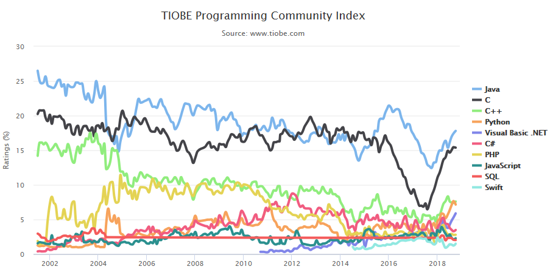

**October 30, 2018**  
**ATMOS 5020: Environmental Programming**  
**John Horel & Brian Blaylock**

> ## From _The Zen of Python_, by Tim Peters  
>Beautiful is better than ugly.  
Explicit is better than implicit.  
Simple is better than complex.  
Complex is better than complicated.   
Readability counts.  
>
>>To read the full _Zen of Python_, type `import this` in a Python terminal.

# Introduction to Python
Python is a popular general-purpose computer programming language invented by the Dutch programmer Guido van Rossum in 1990.

Python has grown into one of the top 5 most-popular programming languages, ranked by usage: https://www.tiobe.com/tiobe-index/. It is heavily used by many companies including Google, Dropbox, Netflix, Facebook, Goldman Sachs, etc. and, of course, in environmental science.

## Why use Python?
- Python software is **open source**, meaning that people can freely modify and share it.
- Python **syntax**, or the programing language's "grammar rules", is relatively intuitive compared to other languages. 
- Python Code can be easier to read due to formatting conventions. 
    - e.g., indented code blocks.
- Code is **interpreted** rather than **compiled**.
- Python is relatively easy to learn. Abundant documentation and learning material available online.

Want to drink the Kool-aid? Look online, e.g., https://docs.python-guide.org/intro/news/

## Python is...

- **Dynamically typed**: This means the type of variable (integer, float, etc.) is determined from the data assigned to that variable. (In some other languages, you have to tell the computer that `5` is an integer and not a string.)
- **Case sensitive**: `temperature`, `Temperature`, and `TEMPERATURE` are 3 distinct variable names.
- **Object oriented**: Everything is an object. This makes coding very flexible but can also be confusing. We'll tend to use Python in a procedural-programming context that should minimize the confusion.

# Python 2 vs 3
Differences in coding are relatively minor but can create issues.
- Version 2.7 remains heavily used, but support for it is _rapidly_ being deprecated.
    - [Python 2.7 Retirement Count Down](https://pythonclock.org/)
- **Version 3.6**, or higher, is what you should be using.

> Note: When searching for online programming help, be aware of the two different versions and look for answers for Python 3.

# You can install Python
Python is free software. The easiest way to install Python on your computer is to download it from a distribution service, like Anaconda. It takes a lot of space, but it is worth it.

Make sure you install **Version 3.6** or higher.

|Source|URL|Description|
|--|--|--|
|Anaconda|https://www.anaconda.com/download/| **RECOMMENDED**. Comes with a lot of extra packages for standard data analysis. Some packages you will use and others you probably won't. [Installation Details](https://github.com/johnhorel/ATMOS_5020_2018/blob/master/supplemental_docs/install_anaconda_windows.md).|
|Miniconda|https://conda.io/miniconda.html| Same as Anaconda, but without the fluff packages you won't use. Instead, you need to install all the packages you want, e.g. `conda install numpy`. If you want to save space on your computer, try this. _Note: I haven't been able to get Python Notebooks to work correctly with this installation._|
|Python Software Foundation |https://www.python.org/downloads/|The raw source for bare-bones Python. Probably not what you want at this point, unless you are ambitious.|

You might also consider installing a nice text editor like [VSCode](https://code.visualstudio.com/).

The following are the library packages we will use in class: `numpy`, `scipy`, `matplotlib`, `pandas`, and `Basemap`. If you installed Python with **Anaconda** or **Miniconda**, you can install or update these packages with the `conda install` command in a terminal or Anaconda Command Prompt.

# A good read
https://www.techrepublic.com/article/why-your-first-programming-language-doesnt-really-matter/

# Terminology
You need to become familiar with terms used typically for all programming languages

| Term | Description | Example |
|--|--|--|
|Script|A file that contains one or more lines of Python code. Ends with the file exension `.py`.| `filename.py`
|Code| Program content 
|Package or Module or Library|Something you import that contains a collection of functions and methods that perform useful actions without writing the code yourself.|`import numpy`
|Statement| Instruction to a computer.| A line of code.
|Assignment| A statement that binds an expression (object) to a variable (name)| `=`
|Object| Anything that a variable can be referred to | a number, string, list, array, function, etc.
|Variable| Name of an assigned object. |
|Expression| Combo of numbers, text, variables, and operators that result in a new object when evaluated| `y = mx+b`
|Function| A block of statements used to create a new object
|Argument| A value passed to a function.| For the statement `max([1,9,5]`, the object inside the `()` is the argument.
|Algorithm| Recipe for how to solve a problem
|Executable| File used to run a programs | `python3`, `jupyter lab`
|Verification| Providing evidence that the program works correctly
|Debugging| Locating and correcting errors in a programs

[Reference: Python Glossary](https://docs.python.org/2/glossary.html)

# Interactive Python in the Classroom
Open the **terminal** or **xquartz**. On the command line, type the following commands, and pay attention to the output:

    which python3

This command should tell you the location of the Python program `python3`.

Now type:

    python3

You are now in Python's built-in Interactive Development Environment (IDLE). You should see something like this:

    Python 3.6.5 |Anaconda, Inc.| (default, Apr 29 2018, 16:14:56)
    [GCC 7.2.0] on linux
    Type "help", "copyright", "credits" or "license" for more information.
    >>>

Press `enter` a few times. The bottom most `>>>` line, known as the prompt, is where you type code. Typing `enter` will run the code you type on that line.

## How to exit the IDLE
Exiting the IDLE depends on the version installed.
- `quit()`
- `ctrl-d` or `ctrl-z`
- Type `quit` to see which ones apply.

# Operators
You can use Python much like a calculator. Type the following statements and press `enter` to run the line of code:   
<!---->
    1+2
<!---->
    1/2
<!---->
    1**2
<!---->  
    1%2
> ## Do it yourself
> Try different numbers and find out what each of the operators do.
>- What does the `+` operator do?   
>- What does the `-` operator do?   
>- What does the `*` operator do?   
>- What does the `/` operator do?   
>- What does `//` operator do?  
>- What does the `**` operator do?  
>- What does the `%` operator do?  

[Reference: Python Operators](https://www.tutorialspoint.com/python3/python_basic_operators.htm)

# Variables
Variables are names that values are assigned to with the `=` operator. In programing, `=` means "assigned to" _not_ "equals".

We can assign values to a variable and use the variables in expressions.

    # Calculate the hypotenuse of a triangle
    a = 3
    b = 4
    c = (a**2 + b**2)**(1/2)
    print(c)

 >Note: The `#` symbol indicates the line is a comment and not code. Everything in the line after the symbol is disregarded when the line of code is run.

|Rules for Variable Names| Example|
|--|--|
|Can be a combos of letters and numbers.|`alpha3`, `Timer8`
|Must start with a letter.| Good: `var1 = 5`  Bad: `1var = 5`
|Can use underscores.| `potential_temperature`|
|Should be descriptive.| `temp` or `temperature` is better than `t`.|
|By convention, use all CAPS for constants:| `TEMP_0C_IN_K = 273.15`

> Note: There are 32 keyword names that are reserved becuase they have special meaning in Python. Variable names cannot be words like `del`, `and`, `if`, `global`, `for`, etc. 
>
>[Reference: Python Keywords](https://www.programiz.com/python-programming/keyword-list)

# Code blocks and indentation
Type the following three lines. Pay careful attention to the number of spaces in lines 2 and 3:

    for i in range(0,5):
        x = i*2
        print(x)

> ## Question: What does this code do?

This is known as a **for loop**. It iterates, or repeats, the same code within the indented block many times for changing values of `i`.

The first line initializes the **for loop**. The syntax to start a **for loop** is `for [variable] in [sequence of objects]:`. The indented code block that follows executes once for changing values of `i`.

The value of `i` changes by the sequence `range(0,5)`. Type `help(range)` to read what range does, then type `q` to exit the help document. 

During each loop, the value of `i` is assigned 0, 1, 2, 3, and then 4 (the last number, 5, is excluded, as described in the help documents). To see what `range()` does, type `range(0,5)` and then type `list(range(0,5))`.

The `:` at the end of the first line is necessary and indicates that a code block follows. Note that each line in the code block is indented exactly 4 spaces. This indentation syntax make Python code more readable.

The second line multiplies the current value of `i` by `2` and assigns the value to the variable `x`.

On the third line, the function `print()` takes the input and writes it to the screen. In this case, it prints the value of `x`.

The loop continues until all the items in `range(0,5)` are exhausted.

In other words, "For each value of `i` ranging from zero to five, assign `x` to `i*2`. Then print the new value of `x`."

    # For Loop Syntax
    for [variable] in [sequence]:
        [do something]

[Reference: Python For Loop](https://www.tutorialspoint.com/python3/python_for_loop.htm)

> ## Do it yourself
> Write another _for loop_ that does something different. Consider the following examples:

    for i in 'letters':
        print("Give me a letter:", i)

    for i in ['apple', 'banana', 'orange']:
        print("Fruit:", i)

---
> Note: If you need help with something, type `help()` to view help documents. You can also view help documents for specific functions like this, `help(max)`.
>    
>To exit the `help()`, type `q` or `ctrl-c`. Alternatively, search online for how to do things.

> Note: You may use the `\` to extend a statement to the next line. We'll later see that there are exceptions when dealing with lists and arrays.

# Data Types
Different types of data can be stored in a variable. It is important to know the difference between the different types and how to convert one type to another. The `type()` function will tell you the type of a variable.

    x = 1000      # An integer
    y = 10.4      # A float
    z = 'Utah'    # A string

## Integer
**Integers are whole numbers**, numbers with no decimal. They can have a value between `-2**31` and `2**31 - 1`
  - Signed integer uses 32 bits (the sign is the 32nd bit)
  
To convert a value to an integer, try:

    x = 5.333
    y = int(x)
    print(y, type(y))
    print(x, type(x))

## Floating Point
**Floats are numbers with a decimal**. They use 64 bits, referred as "double precision" in many other languages.

To convert a value to a float, try:

    x = 5
    y = float(x)
    print(y, type(y))
    print(x, type(x))

## String
**Strings are a sequence of characters** enclosed by single, double, or triple quotes. They can be words or numbers. You can convert an integer or float to a string with `str()`.

Try:

    'Hi'
    b = "Hello, I'm John"
    print(b)

    a = 'Go'
    b = 'Utes'
    print(a + ' ' + b + '!')

    # Convert a float to a string
    str(5.43)

> ## Do it yourself:
>- What happens when you try to convert a string to a float?
>   - Try: `float('5.1')`
>   - Try: `float('5')`
>   - Try: `float('hi')`

To format strings, use the format function.
    
    x = 9.356392
    y = 29
    print('The value of x is {}'.format(x))
    print('The value of y is {}'.format(y))
    print('The value of x is {} and the value of y is {}'.format(x, y))
    print('The value of x is {:.3} and the value of y is {:04}'.format(x, y))

String interpolation, or the string modulo `%` operator, is simpler!

    print('The value of x is: %s' % x)

The first string modulus % indicates the format of the variable after the second %

    x = '%6.1f is less than %3d' % (x, 10)
    print(x)

[Reference: Python String Formatting](https://kapeli.com/cheat_sheets/Python_Format_Strings.docset/Contents/Resources/Documents/index)  
[Reference: Python String Syntax](https://docs.python.org/3/library/string.html#format-string-syntax)
[Reference: Python Strings](https://www.tutorialspoint.com/python3/python_strings.htm)

## None
If a variable is created but not assigned a value, then it has the None type.
   
    a = None
    print(a, type(a))

## Boolean

**A boolean is either `True`  or `False`**. 
  
- True is equivalent to 1 or 1.0
- False is equivalent to 0 or 0.0

Try: 

    bool(0)
    bool(3)
    bool(1-1)
    type(bool(1-1))

Booleans are often used with "comparison operators". Try:

    5 > 9           # Great than
    10 == 3         # Equal to
    12 <= 100       # Less than or equal to
    12 != 3.4       # Not equal to
    
    b = 3 > 8
    print(b)
    type(b)

[Reference: Python Comparison Operators](https://www.tutorialspoint.com/python3/comparison_operators_example.htm)

# Lists and Tuples
## Lists
A list is a collection of objects. A list is **mutable**, meaning that the contents of the list can be changed after it is created.

  - Contents of a list are enclosed by brackets `[]` and separated by commas.
  - Contents do not have to be of the same type.
  
Try:
  
    my_list = [9, -3.5, 'some', 'nothing', True, None, 5]
    print(my_list)

## Tuples
Pronunced _tewple_ and _tupple_. Are similar to lists, but are ***immutable**, meaning that the contents can't be changed once it is created. You might use tuples for list of constants that you don't want the program to change.

  - Contents of a tuple are enclosed by parentheses `()` and separated by commas.
  - Contents do not have to be of the same type.

Try:

    my_tuple = ('many', 7, False, 'nothing', "hi", None, 10.55)
    print(my_tuple)

## Accessing elements in a list or tuple
In lists and tuples, the first element is always the 0th item and the last element is always `-1`.

Try:

    my_list[0]
    my_list[1]
    my_list[-1]
    my_list[-3]

    my_tuple[0]
    my_tuple[1]
    my_tuple[-1]
    my_tuple[-3]

You can also access consecutive items at once by a range of indices.  
Syntax: `my_list[beginning:end:interval]`, where the end index is _one integer greater than the index you want to access_.

  - Think of the beginning and end as boundaries of the elements rather than the index values themselves.
  - The interval (or stride) is optional.
  - The beginning or end (or both) can be omitted, which will return all of the elements relative to the remaining boundary.

Try:
    
    my_list[1:3]

    my_tuple[0:2]
    my_list[:]
    my_tuple[:-1]
    my_list[-2:]

> ## Question: Do you understand how indexing works?

By striding through a list you can skip over elements or reverse direction using the striding interval.

 Try:
    
    my_list[::2]
    my_tuple[::-1]
    my_list[1:6:2]

## Reassigning values in a lists
You can't change the value in a tuple, but you can change items in a list.

Try:

    a = my_tuple
    a[2] = 'test'

> ## Question: What happened?

Try:

    b = my_list
    print(b)
    b[2] = 'test'
    print(b)

> ## Question: Now what happened?

## Dictionary
Dictionaries are another useful ways to organize objects. Dicionaries are organized in a **"Key-Value pair"**. Keys can either be numbers or strings.

    my_dictionary = {1:'b',
                     2: [23,265,12,43],
                     3: ('this', 'is', 'a tuple')}

    print(my_dictionary.keys())
    print(mydictionary[1])

    another_dictionary = {'name':'Brian',
                          'school': 'university of utah,
                          'numbers': [1,2,3,4,5,6]}
    print(another_dictionary.keys())
    print(another_dictionary['name'])
    print(another_dictionary['name'][0])

[Reference: Python Dictionary](https://www.tutorialspoint.com/python3/python_dictionary.htm)

 

---

# Extra Practice Exercises 
You now know enough to perform some useful tasks in Python.

## 1. Practice writing loops and lists

- Write a Python loop that sums all the numbers in a list.
- Write a Python loop that finds the smallest value of a list.

## 2. Save and run a script

Just like writing shell scripts, you can save Python code in a text file and run the code from the file known as a Python script. 

In a text editor, type several lines of Python code and include some print statements. Save the file as `my_script.py`. In the terminal, `cd` to the directory where the script is saved and run your script by typing the following:

    python3 my_script.py

You will notice that the program exits after it runs. If you want to run the script and stay in the interpreter, type `-i` before the name of the script:

    python3 -i my_script.py

## 3. Average Number Calculator
For this short exercise, we will make a simple "Average Number Calculator". Save this Python code to a text file called `average_score_calc.py`.

Note: the `input()` function asks for user input.

    # Get three test score
    round1 = int(input("Enter score for round 1: "))
    round2 = int(input("Enter score for round 2: "))
    round3 = int(input("Enter score for round 3: "))
    
    # Calculate the average
    average = (round1 + round2 + round3) / 3

    # Print out the test score
    print("The average score is: ", average)

Run the program from the terminal (remember to `cd` to the same directory that the script is located in).

    python3 average_score_calc.py
