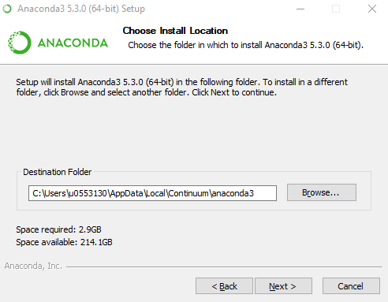

**Brian Blaylock**  
**October 15, 2018**

# Install Python on Windows with Anaconda3
Anaconda is a distribution service that installs and manages Python software and libraries.

Download the Python 3.7 Anaconda3 installer for Windows from https://www.anaconda.com/download/ and run the executable.

Click through the set up windows

 Install Anaconda in the default location:

I needed this additional option selected, but you may or may not want to. It shouldn't cause any problems unless you have other versions of Python already installed. Installing may take 5+ minutes.

If everything worked right, Anaconda3 installed without issues. Click `next` and then `finish`.

After installation, Anaconda will suggest installing VSCode. This is a nice text editor I recommend using. You can install VSCode now or a later time. https://code.visualstudio.com/

## Confirm Python installed correctly

Open the Windows `PowerShell` or `cmd` window and type `conda` to make sure the conda software installed.

    conda

Open Python and try importing some libraries...

    python
<!---->
    import numpy as np
    np.sin(np.pi/2)

    import matplotlib.pyplot as plt
    plt.plot(range(0))
    plt.show()      # This will open the graph in a new window

Close the pyplot window and exit Python by tying `exit()`.

For a final check, open Jupyter Lab.

    jupyter lab

 Create a new notebook, write some cells, run some code. 

 👍🏻 You're good to go!

 

---

# How to install additional packages with `conda install`.

Anaconda comes with many popular packages like `numpy`, `matplotlib`, `jupyter`, etc. But there are many other useful packages you may want to install. Anaconda's `conda install` command makes installing other packages easy. 

Go to https://anaconda.org/ and search for a package you wish to install. The following steps uses `numpy` as an example.

Search for `numpy`

Software is distributed through different "channels." The **conda-forge** channel is pretty standard and contains a lot of what you might want. Click `conda-forge/numpy`.

Towards the bottom of the page, there are instructions for installing numpy using the `conda` command. The first method listed is 99.99% what you want. Copy that line.

Back in the `PowerShell`, type the installation command. 

    conda install -c conda-forge numpy

The Anaconda package manager will check for any dependencies that need to be installed or updated for numpy to work properly. Type `y` to continue the install.

After installation, open Python and import the new library to see if it works correctly.

## Other Useful Packages for Environmental Science

    conda install -c conda-forge matplotlib
<!---->
    conda install -c conda-forge scipy
<!---->
    conda install -c conda-forge pandas
<!---->
    conda install -c conda-forge cartopy
<!---->
    conda install -c conda-forge pyproj
<!---->
    conda install -c conda-forge metpy
<!---->
    conda install -c conda-forge netcdf4
<!---->
    conda install -c conda-forge h5py
<!---->
    conda install -c conda-forge xarray
<!---->
    conda install -c conda-forge pygrib

Note: `pygrib` is not available on Windows PC.

<!---->
    conda install -c conda-forge basemap
<!---->
    conda install -c conda-forge basemap-data-hires

Basemap is currently having issues being installed by Anaconda (not sourcing PROJ_LIB correctly when imported). Maybe it's working now?? This package is being depreciated soon, so it's best to learn cartopy.

---

If want to really get into using Python for different things, you might consider setting up conda environments and instal packages from a .yml file. Google around for how to do that and check the [Unidata tutorial](https://github.com/Unidata/unidata-users-workshop).