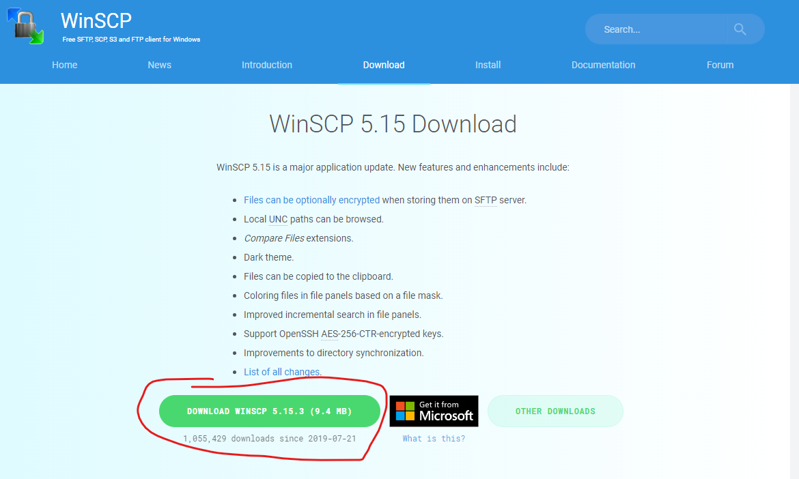
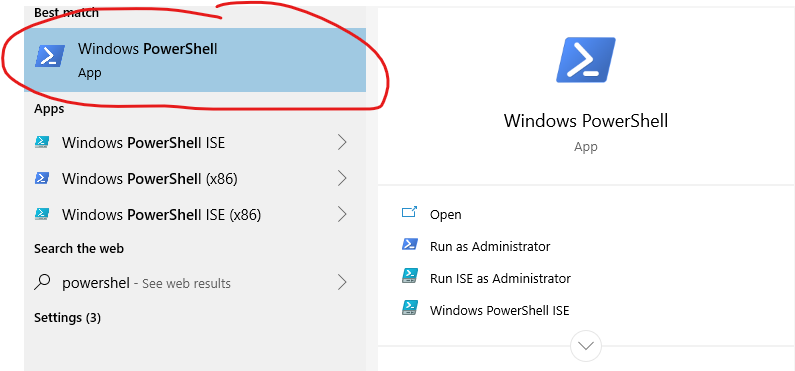
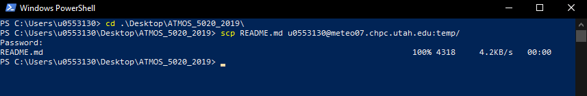
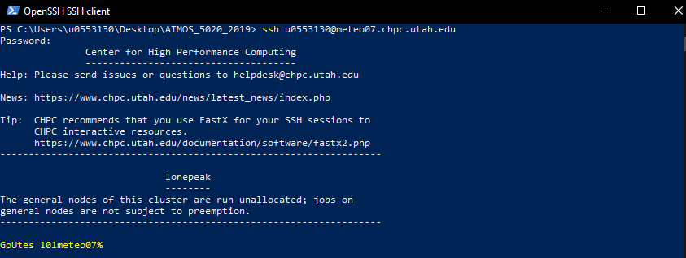
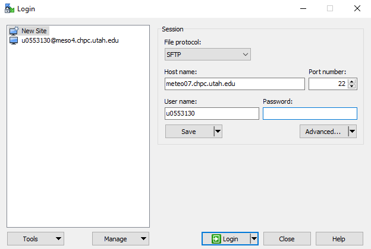
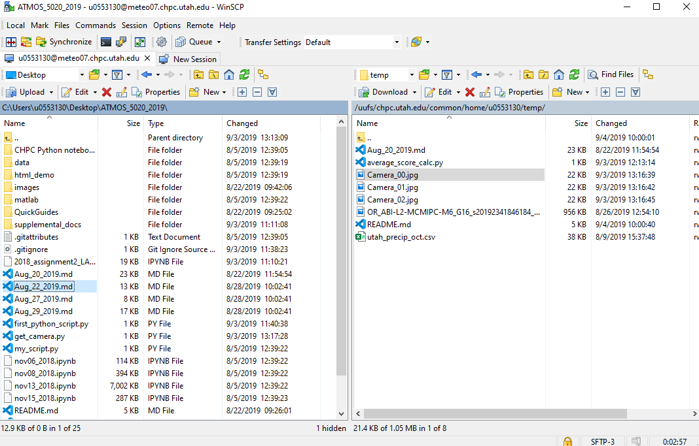

**Brian Blaylock**  
**September 4, 2019**

# **How to log onto a CHPC machine from your Windows PC**   Putty, Xming, PowerShell, and WinSCP

## Install Putty, Xming, and WinSCP

## Downloads
You will need to download and install three different programs. Later, you will see how to use the built-in **Windows PowerShell**.

1. [Putty](https://putty.org/): Software to log onto a remote machine like `meteo07` on CHPC.
1. [Xming](https://sourceforge.net/projects/xming/): Enables forwarding of graphic from the remote machine with Putty.
1. [WinSCP](https://winscp.net/eng/download.php): A different program that allows you to move files between your local computer and the CHPC remote computer. (We will get to this last).

These are all free downloads. Install each with the default settings. 

  
# Log onto CHPC with Putty and Xming graphics
This section demonstrates how to log onto a CHPC remote computer `meteo07.chpc.utah.edu` with Putty. Xming is necessary if you want to display graphics from the remote computer.

## First, run Xming
In the search or start menu, run Xming. **Note: Running this program doesn't open a program window, but it does put an xming logo in the bottom right corner of your computer.**

In your task bar, you will see the logo.

## Open Putty
 It should look like this...

## Enable X11 forwarding
X11 makes it possible to forward graphics from CHPC to your computer. This requires xming and is why you just installed and ran it. Before you log on, you have to enable it.

- On the left side, click the `+` sign next to `SSH`.
- Click `X11`, again on the left side.
- Select the box next to `Enable X11 Forwarding`

## Log onto CHPC machine

On the left side, click back on the `Session` section. 

- For the `Host Name (or IP address)` type `meteo07.chpc.utah.edu`.
- For the `Saved Session`, give it a name: `meteo07`. 
- Click `Save`.

Next time you need to log on, you can click the name of the session, then `Load` and it will load your settings.

**Now click `Open`.**

The first time you log on, it will ask for host keys. Select `yes`.

A black terminal box will open. Finally, enter your uNID (press enter) and then your password (press enter).

> NOTE: If you don't want to type your uNID every time you log in, you can change the setting in the `Data` section on the left side. There is a input for `Auto-login Username` that you would set as your uNID. _After changing this setting, remember to "save" the session profile_.

You are now using the linux terminal on `meteo07`. If you installed and are running Xming, you should also be able to use `gedit` to edit files and display image files with `display`.

> ### ❓❓ **I get a display settings error!**
> An error when you try to open any graphics that say something like `not able to get display resources` is likely caused by two things: 1) you did not enable X11 forwarding when you logged in with Putty or 2) You do not have Xming running on your computer. If this happens, close Putty, open Xming, make sure X11 forwarding is enabled in Putty, and log in again.

  
# How to transfer files to CHPC with PowerShell
In class on the Mac computers, we learned how to transfer files in the terminal with the `scp` command. Recall,

    scp file_to_transfer uXXXXXXX@meteo07.chpc.utah.edu:public_html/5020

If you have the **Windows 10 April 2018 Update** you can do this same thing on your Windows PC with the Windows PowerShell. 

> Note: You may or may not need to enable the feature. Give the below a try first, but if it doesn't work then [follow the instruction here.](https://www.howtogeek.com/336775/how-to-enable-and-use-windows-10s-built-in-ssh-commands/)

## Open Windows PowerShell

## Use the `scp` and `ssh` commands
Use your favorite linux commands to `cd` into the directory with the file you wish to transfer to CHPC. 

> Note that while PowerShell is not Linux, some commands are similar. `cd`, `ls`, `pwd` should work as expected. If you do any more than that, you will see that this shell has it's own unique flavor.  
>
>Notice that Windows uses `\` instead of `/` to describe directory paths.

Now `scp` (secure copy) a file to `meteo07`. In the example below, I copied the file `README.md` into a directory called `temp` on meteo07. 

You can even ssh onto the remote machine with PowerShell...

## **The reason why we did things in Putty first is because PowerShell can not forward graphics with X11 (yet, maybe someday).**

  
# How to transfer files with WinSCP
Ok, ok, so dealing with typing in a terminal might not be as "convenient" as using a mouse. The WinSCP program enables you to drag-and-drop files between your local computer and the remote computer.

Open WinSCP and input the host name `meteo07.chpc.utah.edu`, your user name is your uNID, and your then type your password. Then click the "save" button to save the profile, and then "login." For the first time logging in, it will ask about host keys. Select "yes."

The screen will look similar to the image below. On the left is your computer's files, and on the right is the remote computer's files. You can drag and drop files between the two to transfer the files between the computers.

You can even edit files on the remote machine on your local machine without transferring the file. Right click and select 'open' or 'edit' and 'edit with' to select the program you want to edit the file with (like VSCode)
