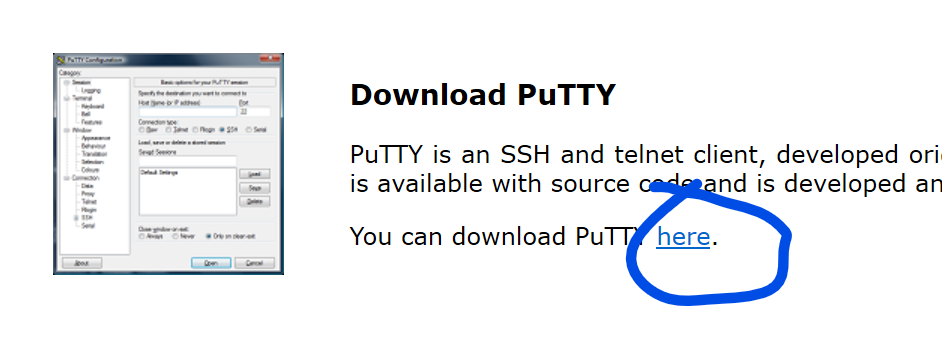
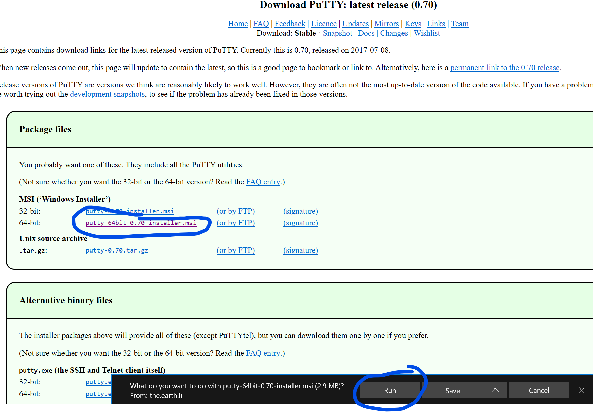
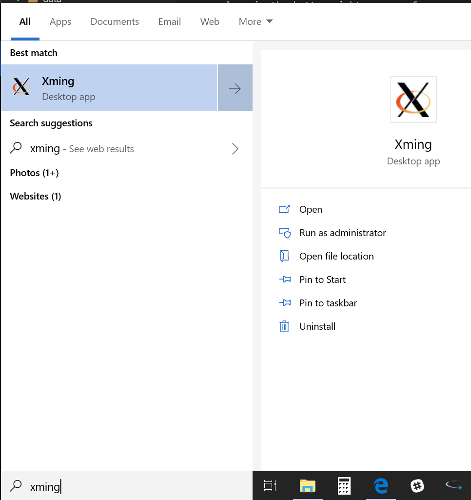
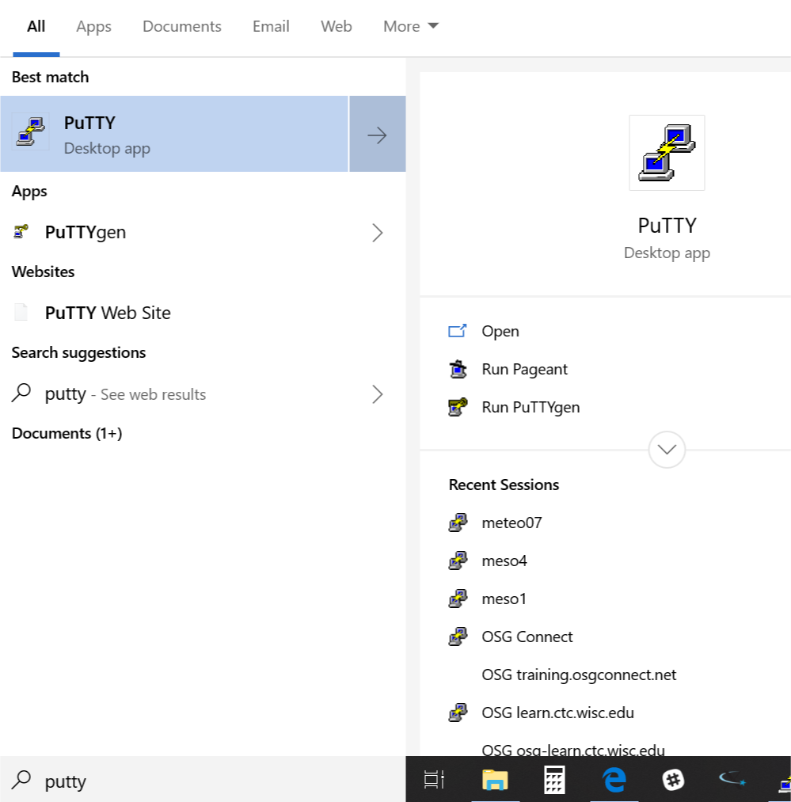
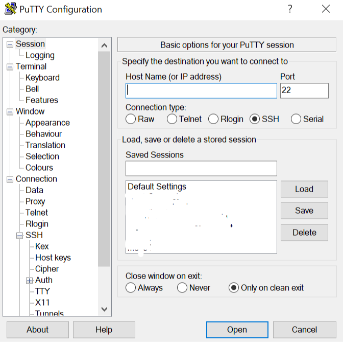
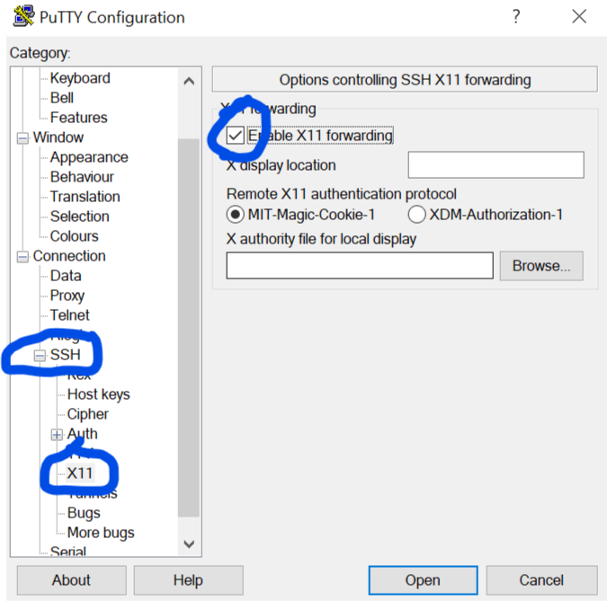
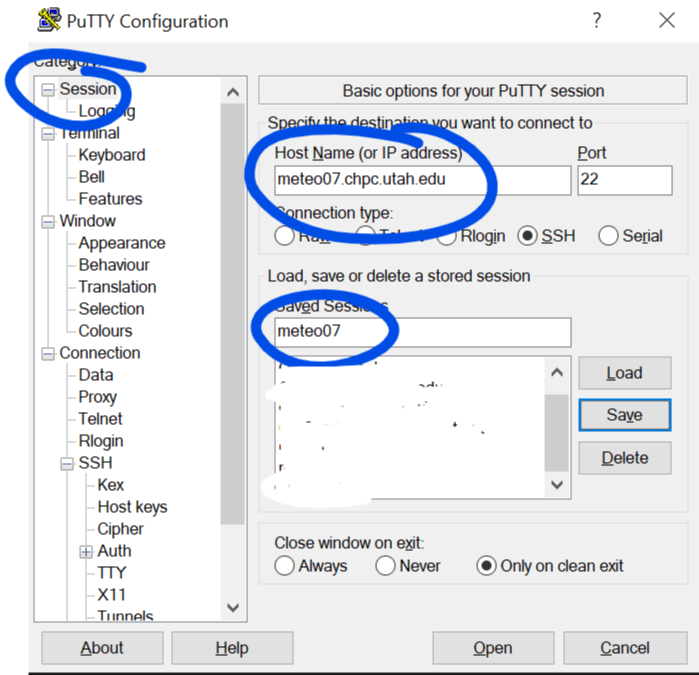
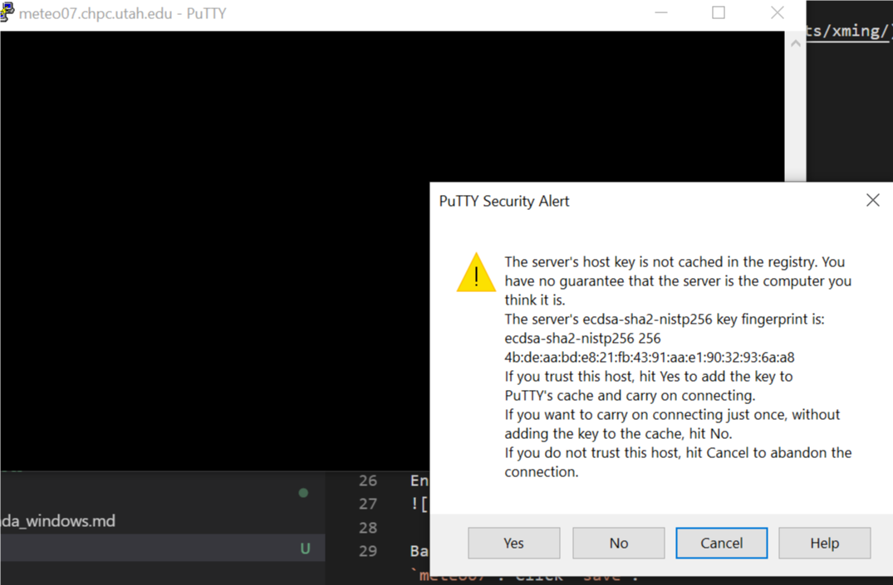

**Brian Blaylock**  
**October 26, 2018**

# How to log onto CHPC resources from a Windows PC

You will need to download and install two different softwares

## Downloads

1. [Putty](https://putty.org/)
1. [Xming](https://sourceforge.net/projects/xming/)

Install both with the default settings.

## Run Xming
In the search or start menu, run Xming. Note: this doesn't open a program window, but it does put an xming logo in the bottom right corner of your computer.

## Open Putty to log onto CHPC computers
Open Putty. It should look like this...

### First, enable X11 forwarding
X11 makes it possible to stream graphics from CHPC to your computer. This is why you installed Xming.

- On the left side, click the `+` sign next to `SSH`.
- Click `X11`, again on the left side.
- Selcet the box next to `Enable X11 Forwarding`

### Log onto CHPC

On the left side, click back on the `Session` section. 

- For the `Host Name (or IP address)` type `meteo07.chpc.utah.edu`.
- For the `Saved Session`, give it a name: `meteo07`. 
- Click `Save`.

Next time you need to log on, you can click the name of the session, then `Load` and it will load your settings.

**Now click `Open`.**

The first time you log on, it will ask for host keys. Select `yes`.

Finally, enter your uNID (press enter) and then your password (press enter).

You are now in the linux terminal on `meteo07`. If you installed and are running Xming, you should also be able to use `gedit` to edit files and display image files with `display`.

> **I get a display settings error!** An error when you try to open any graphics that say something like `not able to get display resources` is likely caused by two things: 1) you did not enable X11 forwarding when you logged in with Putty or 2) You do not have Xming running on your computer. If this happens, close Putty, open Xming, make sure X11 forwarding is enabled in Putty, and log in again.

